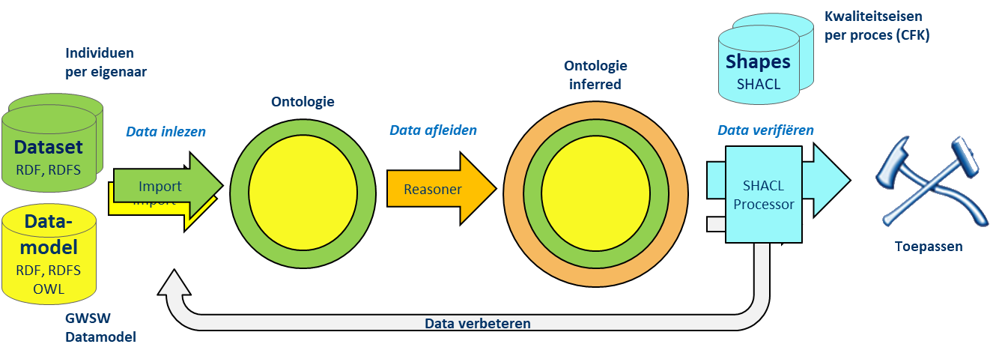
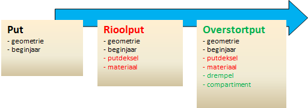
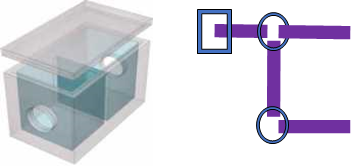
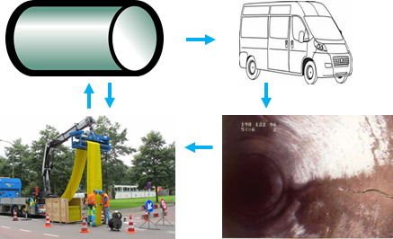
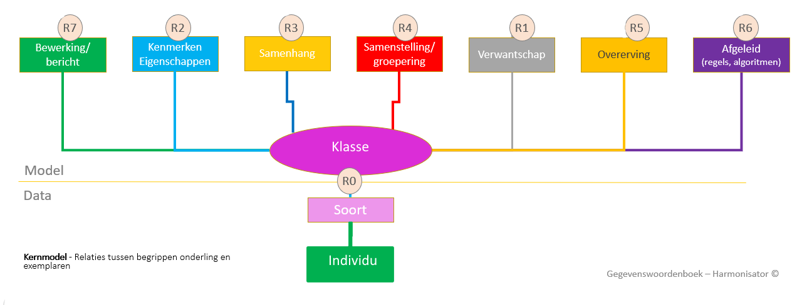
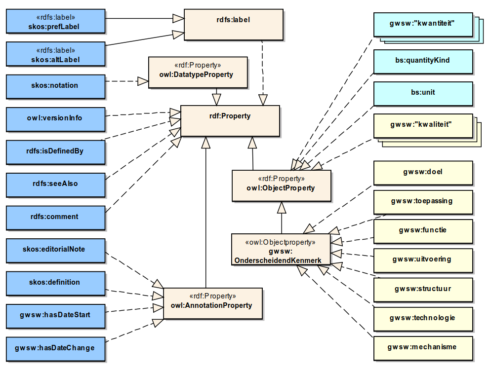

# GWSW Ontologie 2.0

<!-- gebruik voor lokaal editen -->

**Een beschrijving van de GWSW Ontologie op basis van de [NEN 2660-2:2022 nl](https://www.nen.nl/nen-2660-2-2022-nl-291667)**

Versie historie

20230511: Vervolg implementatie NEN2660
20221220: Eerste aanpassingen op vervanging NTA 8035 door NEN2660  
20221220: Algemene update, hou synchroon met figerende GWSW Ontololgie-document  
20221202: Overzicht verschillen met IMBOR-LD toegevoegd  
20211025: Hoofdstuk indeling afgestemd op document [GWSW Ontologie in RDF]  
20201005: Hst Modelleerprincipes bijgewerkt
20200817: Voorwaarden bij concept-annotaties uitgeschreven, hst 3.2.1  
20200814: Annotaties vanuit Gellish toegevoegd (editor, fact-collectie)  
20200514: Figuren met metamodellen en bestandsvormen bijgewerkt  
20200509: URI-strategie toegevoegd, ook voorstel voor individuen  
20200507: Commentaar van Michel (overleg dd 20200506) verwerkt  
20200505: Diverse kleine tekstaanpassingen  
20200430: Volledig bijgewerkt op basis laatste NTA 8035:2020 en SHACL proefnemingen  
20200415: Proefneming in voorbeelden uitgewerkt  
20200408: SHACL toepassing voor data-verificatie toegevoegd  
20200325: Bijgewerkt op basis (teams)overleg met TNO (Michel) (20200324)  
20200214: Bijgewerkt op basis laatste versie van NTA 8035:2020 (20200211)  
20200103: Opmerking toegevoegd: is Topologisch element wel een nen2660:Property?  
20200102: Voorstel integratie van NTA 8035

 

# Inleiding

Het W3C definieert standaarden voor het Semantisch Web met als basis de triple-vorm: de Subject-Predicate-Object constructie. Het basisprotocol dat hieraan ten grondslag ligt is de linked data taal RDF.

Begin 2020 is gestart met het ontwerp van GWSW 2.0, gebaseerd op de in die tijd uitgebrachte NEN NTA 8035:2020, opgevolgd door de NEN 2660 deel 1 en 2.Het generieke uitwisselformaat GWSW-OroX wordt hiermee ook herzien, functioneel zal de uitwisseling van de GWSW linked data gegevens niet veel gaan wijzigen GWSW versie 2.0 beschrijft de RDF-implementatie op de NEN 2660-2 (verder genoemd NEN2660) voor de discipline Stedelijk Water.

Bij de uitwerking van dit document is er van uitgegaan dat de lezer bekend is met de principes van RDF/RDFS/OWL 2/SHACL en het uitwisselformaat Turtle.

In de voorbeelden en in de praktijk (bij uitwisseling van GWSW-gegevens) gebruiken we het Turtle-formaat. Voor de concepten binnen de GWSW-Ontologie hanteren we in de voorbeelden de prefix “gwsw:”. Voor individuen in een dataset wordt de prefix “ex:” gebruikt.

In deze inleiding vindt u de gebruikte begrippen en uitgangspunten bij de modellering. In het volgende hoofdstuk worden modelleringsprincipes toegelicht. Het laatste hoofdstuk bevat de gedetailleerde uitwerking van het RDF model, gecombineerd met voorbeelden van het datamodel en datasets.

## Gebruikte begrippen

**Linked data: RDF, RDFS, OWL 2, SHACL**  
RDF staat voor Resource Description Framework, de basisdefinitie van modellen op basis van subject-predicate-object. In de tekst verstaan we onder "linked data" de combinatie van RDF en de daarop gebaseerde schema's RDFS (RDF Schema), OWL 2 (Web Ontology Language) en SHACL (Shapes Constraint Language). Met de term OWL wordt OWL 2 aangeduid.

**CE, OPE, DPE**  
Deze afkortingen hanteren we in de OWL definities. De afkorting CE wordt gebruikt voor Class Expressions (in Description Logics “complex concepts”). CE’s worden ondermeer gevormd door Classes te binden aan Object Property Expressions (OPE). Data Property Expressions (DPE) beschrijven restricties op de waardetypes.

**Concept**  
De mentale voorstelling van iets uit de werkelijkheid (NEN 2660-1).

**Individu**  
Een individueel concept (NEN 2660-1), iets (potentieel) aanwijsbaars uit de werkelijkheid. Zoals individu “0980” in werkelijkheid de betonnen constructie van de klasse/concept “rioolput” is.

**Klasse, subtype, supertype**  
Concepten die hiërarchisch zijn onderverdeeld in groepen noemen we klassen, het zijn de bouwstenen van de soortenboom. Zo'n soortenboom wordt ook wel taxonomie genoemd. In de GWSW-hiërarchie gebruiken we de termen Supertype - Concept - Subtype. Een subtype is de "specialisatie" van de klasse, het supertype is de "generalisatie" van de klasse.

**Property, predicate (attribuut, relatie)**  
Voor de relatie (tussen subject en object) zijn meerdere namen gebruikelijk (“predicate”, “property”). Conform de NEN 2660-2 hanteren we de term "attribuut" voor kenmerken en annotaties, en voor de overigen de term "relatie". Voor de verzamelnaam gebruiken we "property"

**Ontologie**  
Een samenhangende gegevensstructuur bestaande uit concepten, hun attributen en onderlinge relaties, instanties van die concepten en waardetypen.

**Model, Dataset**  
Binnen de GWSW ontologie beschrijft het datamodel (model) de concepten en hun relaties, de dataset bevat de “individuen”, bijvoorbeeld een fysiek stedelijk water systeem. Voor het model wordt ook wel de term TBox gebruikt: “terminological components”. Voor de dataset wordt ook de term ABox gebruikt: “assertion components”.

## Inrichting GWSW-OroX protocol

De ontologie is gebaseerd op de volgende hoofdstructuren:
-   Soortenboom (de taxonomie of specialisatie-indeling)
-   Samenstelling (de meronomie of deel-geheel indeling)
-   Proces (de activiteiten met in- en uitvoer)
-   Collecties (groeperingen van concepten of individuen)

De belangrijkste "top level" concepten (supertypes) zijn:
-   Fysiek object
-   Activiteit

Bij het ontwerp van de datastructuur spelen deze elementen de hoofdrol. Met de NEN2660 vormen ze het ontwerpkader, de ruggengraat van het GWSW. De GWSW ontologie onderscheidt zich door diepgang in semantiek en reikwijdte in de toepassing (van systeem tot proces). De soortenboom van het GWSW bevat op dit moment (versie 1.5) circa 1500 klassen.

## Drie bestandsvormen

De ontologie omvat zowel het model (de concepten en relaties, zie [data.gwsw.nl](https://data.gwsw.nl)) als de daarop gebaseerde datasets (de individuen, zie [apps.gwsw.nl](https://apps.gwsw.nl)). Vanaf GWSW 2.0 wordt naast het Model en Dataset een derde datastructuur gebruikt: de Shapes met daarin SHACL graphs voor data-verificatie (de conformiteitsklasse - CFK). (De Shapes vervangen de filters op vorige GWSW-versies met daarin aangescherpte OWL-restricties).

Het model is zo ingericht dat hiermee vergaande afleiding van de data in de Dataset mogelijk is ("inferencing"). Daarnaast dienen de Shapes om - afhankelijk van het toepassingsproces - kwaliteitseisen te formuleren en via de SHACL processor te verifiëren.  

*De rol van de drie bestandsvormen Model, Dataset en Shapes bij de toepassing van het GWSW:*

Voorbeelden van de drie bestandsvormen zijn in dit document als volgt gemarkeerd:

Model:
<pre>
    Voorbeeld model
</pre>

Dataset:
<pre>
    Voorbeeld dataset
</pre>

Shapes:
<pre>
    Voorbeeld SHACL graphs
</pre>

## Uitgangspunten

Een belangrijk principe is de object-georiënteerde modellering: het model hanteert overerving-principes en maakt zo expliciet mogelijk onderscheid in subtypen van de genoemde supertypen. Dat is een heel andere benadering dan bijvoorbeeld het ontwerp van een relationeel model. Daarbij ligt de nadruk ligt op het interpreteren van informatie met een hoofdrol voor de normalisatie-techniek om opslagruimte te beperken en redundantie te voorkomen. RDF is vanwege zijn binaire relaties van zichzelf optimaal genormaliseerd, wijzigingen beperken zich tot toevoegen of verwijderen van triples.

Voor de modellering is uitgegaan van het OWL RL (Rule Language) profiel. Dit profiel gebruikt nagenoeg alle OWL 2 semantiek en is toereikend voor het modelleren van de GWSW-Ontologie.

Voor de definitie van klassen, eigenschappen, datatypen en restricties kunnen verschillende benaderingen gekozen worden. De volgende uitgangspunten zijn gehanteerd:

Uitgangspunten bij de bouw van de GWSW ontologie:
* Bij de indeling van soorten, de vaststelling van de taxonomie, wordt de onderscheidende definitie zo expliciet mogelijk beschreven.
*  Validaties en specificaties voor data-verificatie beschrijven we in SHACL.
*  De SHACL shapes kunnen in meerdere vormen voorkomen en staan naast de GWSW ontologie. De shapes worden gebaseerd op de vereiste datakwaliteit per proces. De zogenaamde conformiteitsklassen.
*  De ontologie is volledig gebaseerd op de NEN2660. Het GWSW gebruikt ook de NEN-methode voor het beschrijven van attributen. Die is geïnspireerd op de Ontology for Property Management (OPM), zie https://w3c-lbd-cg.github.io/opm .
*  De modellering wordt getest met Protégé 5.5.0, in combinatie met de HermiT- en Pellet-reasoners en SPARQL- en SHACL-plugins.

Het laatste hoofdstuk bevat voorbeelden waarbij deze uitgangspunten worden toegepast.

### Taalbinding naar RDF gebaseerde standaarden

De volgende standaardformaten of -talen hanteren we in de GWSW ontologie:

<table class="simp">
<tr><td>RDF </td><td>Het Resource Description Framework, de basisdefinitie van modellen op basis van subject-predicate-object.</td></tr>
<tr><td>RDFS </td><td>Een schema op RDF voor het structureren van ontologieën, onderscheidt concepten en individuen</td></tr>
<tr><td>OWL </td><td>Web Ontology Language (versie 2), voegt mogelijkheden toe om klassen, properties en datatypes door middel van restricties te definiëren</td></tr>
<tr><td>SHACL </td><td>Shapes Constraint Language, een taal waarmee restricties op RDF graphs beschreven worden</td></tr>
<tr><td>SKOS </td><td>Simple Knowledge Organization System. Gericht op het uitdrukken van kennisorganisatie systemen (KOS) zoals vocabulaires, woordenboeken en thesauri.
<tr><td>NEN2660 </td><td>De door NEN gepubliceerde Regels voor informatiemodellering van de gebouwde omgeving - Deel 2: Praktische configuratie, extensie en implementatie van NEN 2660-1. Gebaseerd op RDF, RDFS, SKOS, OWL en SHACL.</td></tr>
</table>

### Gebruikte namespaces 

<table class="simp">
<tr><td>RDF</td><td>rdf:</td><td>&lt;http://www.w3.org/1999/02/22-rdf-syntax-ns#&gt;</td></tr>
<tr><td>RDFS</td><td>rdfs:</td><td>&lt;http://www.w3.org/2000/01/rdf-schema#&gt;</td></tr>
<tr><td>OWL</td><td>owl:</td><td>&lt;http://www.w3.org/2002/07/owl#&gt;</td></tr>
<tr><td>SHACL</td><td>sh:</td><td>&lt;http://www.w3.org/ns/shacl#&gt;</td></tr>
<tr><td>SKOS</td><td>skos:</td><td>&lt;http://www.w3.org/2004/02/skos/core#&gt;</td></tr>
<tr><td>NEN2660</td><td>nen2660:</td><td>&lt;https://w3id.org/nen2660/def#&gt;</td></tr>
<tr><td></td><td>smls:</td><td>&lt;https://w3id.org/def/basicsemantics-shacl#&gt;</td></tr>
<tr><td>Datatypes</td><td>xsd:</td><td>&lt;http://www.w3.org/2001/XMLSchema#&gt;</td></tr>
<tr><td>Geo-definities</td><td>geo:</td><td>&lt;http://www.opengis.net/ont/geosparql#&gt;</td></tr>
<tr><td>Grootheden</td><td>quantitykind:</td><td>&lt;http://qudt.org/vocab/quantitykind/&gt;</td></tr>
<tr><td>Eenheden</td><td>unit:</td><td>&lt;http://qudt.org/vocab/unit/&gt;</td></tr>
</table>

Voor de concepten en relaties uit de GWSW-Ontologie hanteren we in de voorbeelden de prefix “gwsw:”. Voor individuen in een dataset wordt de prefix “ex:” gebruikt.

<table class="simp">
<tr><td>GWSW-Model</td><td>gwsw:</td><td>&lt;https://data.gwsw.nl/2.0/totaal/&gt;</td></tr>
<tr><td>GWSW-Dataset</td><td>ex:</td><td>&lt;https://w3id.org/def/example#&gt;</td></tr>
</table>

# Modelleerprincipes - Alle GWSW versies

Een groot deel van de gehanteerde modelleerprincipes stammen uit de oorspronkelijke opzet (gestart in 2006) van het model in Gellish-vorm. Deze principes zijn natuurlijk taalonafhankelijk, ook in de RDF-vorm blijven ze van groot belang. Veel dank gaat naar Andries van Renssen, geestelijk vader van Gellish en Matthé van Koetsveld, intensief betrokken bij de modellering in Gellish van het GWSW en zijn voorlopers.

## Reikwijdte model

Het GWSW Datamodel volgt de ontwikkelingen in het vakgebied. Het bevat concepten die actief worden toegepast (in uitwisseling en applicaties) of die in ontwerpen voor toepassing (bijvoorbeeld nieuwe uitwisselvormen) zijn opgenomen. Dat geldt ook (en vooral) voor kenmerken van objecten.  
Terminologie waarbij het uitsluitend gaat om vastleggen van definities wordt met terughoudendheid opgenomen, maar het GWSW heeft zeker ook een woordenboek-functie.

Bij het ontwerp van het GWSW Datamodel spelen altijd de volgende **invalshoeken** mee:
* Wordt het concept algemeen gebruikt in - native - databases, wordt het (straks) uitgewisseld via GWSW Datasets
* Welke gevolgen heeft de aanpassing voor de toepassingen:
  * Externe applicaties die GWSW Datasets gebruiken
  * De geografische presentaties (en onderliggende queries)
  * De uitwisselformaten HydX, RibX
  * De kwaliteitsmetingen van datasets: dataverificatie met Nulmeting, SHACL
* Zijn de aanpassingen relevant voor het GWSW als naslagwerk en woordenboek

**"As is", een momentopname**  
Het datamodel beschrijft de "as is" situatie, het bevat een momentopname van systemen en processen binnen de discipline stedelijk water. Het beschrijft dus geen historische gegevens of de levenscyclus van objecten zoals binnen de context van system engineering.

## Structureren

Zoals genoemd is de datastructuur object-georiënteerd waarbij objecten in een aantal hoofdstructuren zijn ondergebracht:

* Soortenboom (de taxonomie of klasse-indeling)
* Samenstelling (de meronomie of deel-geheel indeling en de processchema's)
* Proces (het activiteiten-schema)
* Groeperingen (collecties van individuen of soorten)

Bij het ontwerp spelen deze structuren de hoofdrol, ze vormen het ontwerpkader. Met het principe van object-oriëntatie hanteert het model overerving-principes en maakt zo expliciet mogelijk onderscheid in (relaties tussen) subtypes.

<strong>Voorbeelden:</strong>
 Afgeleide gegevens komen niet voor in de definitie van fysieke objecten, bijvoorbeeld het kenmerk "aantal pompen". Zo'n gegeven wordt (in presentaties) afgeleid uit het aantal voorkomens van de relatie gwsw:hasPart tussen Gemaal en Pomp. De objecten Gemaal en Pomp worden expliciet beschreven.  
 Afgeleide gegevens zoals rekenresultaten en data-analyses komen in het GWSW wel voor in de vorm van gemodelleerde rapportages, bijvoorbeeld in GWSW Kengetallen. 
 Eigenschappen van de bovengrond en ondergrond (maaiveldhoogte, grondsoort) komen niet voor als aspecten van de fysieke objecten die zich daarin bevinden. Een leiding heeft niet als kenmerk "Grondsoort", wel wordt er een relatie gwsw:isPartOf met de ondergrond - en dus met bijbehorende kenmerken - gedefinieerd.

## Concepten en annotaties

1. Elk GWSW-concept is van het generieke type owl:Class.
2. Een concept en elke CE wordt altijd voorzien van de annotaties zoals opgenomen in hst [Details annotaties](#details-annotatie-attributen)
3. Voeg zoveel mogelijk extra informatie toe zoals afbeeldingen (verwijs via rdfs:seeAlso)

## Naamgeving

_Terminologie_

Zie hst [Identificatie van concepten](#identificatie-van-concepten)

1. Een concept wordt geïdentificeerd door de URI (prefix + naam)
2. Volg de gebruikelijke termen binnen het vakgebied, bedenk geen nieuwe conceptnamen die misschien de lading beter dekken of neutraler zijn. Dat geldt ook - waar mogelijk - voor abstracte concepten.
3. Voorkom zoveel mogelijk het gebruik van handels- of merknamen in de conceptnamen.
4. Geef alle gebruikelijke vakgebied-termen die gelden voor het te modelleren systeem of proces een plek, als apart concept of als synoniem van een concept. De zoekfunctie wordt daarmee volledig.
5. Laat algemene termen die niet specifiek bij de discipline horen zoveel mogelijk buiten beschouwing. Modelleer bijvoorbeeld het concept "calamiteit" alleen als het als supertype nodig is.
6. Verwijs voor algemene termen waar mogelijk naar andere databronnen (rdfs:seeAlso).

## Data-afleiding en -verificatie

Definieer klassen zo uitgebreid mogelijk op basis van hun eigenschappen. Daarmee worden datasets op basis van het datamodel ruimer interpreteerbaar en beter valideerbaar. Hier volgt een opsomming van de mogelijke afleidingen (inferences) en uit de CE's afgeleide validaties. In enkele gevallen is reasoning op basis van het UNA (Unique Name Assumption) principe nodig. De controle op kardinaliteit is beperkt vanwege het OWA (Open World Assumption) principe in RDF.

* Controle op hasReference-waarden binnen domein van collecties / keuzelijsten (UNA)
* Controle op correcte typering binnen samenstellingen via gwsw:hasPart.
  - Ruimte gwsw:hasPart “Object”. Object: alleen van de klasse Ruimte of FysiekObject
  - FysiekObject gwsw:hasPart “Object”. Object: alleen van de klasse Ruimte of FysiekObject
* Inferencing: Individu-klasse wordt afgeleid uit intrinsiek aspect.
    - gwsw:hasAspect BreedteLeiding =&gt; Individu = Leiding
* Inferencing: Individu-klasse wordt afgeleid uit onderscheidend kenmerk.
    - gwsw:hasAspect Uitvoering + hasReference Klein =&gt; Individu = KleinObject
* Controle op correct gebruik datatype bij gwsw:hasValue: decimal, string, integer, double, date, time, year.
* Controle op numerieke waarden binnen minimum maximum grenzen
* Kardinaliteit, aantal voorkomens per property boven het voor het type gedefinieerde maximum wordt gemeld (UNA)
  - ook “inverse”-kardinaliteit wordt in de reasoning meegenomen
  - minimum kardinaliteit en shall-relatie wel gemodelleerd, controle op strijdigheid met typering niet mogelijk (OWA)
  
## Soortenboom

 

<strong>Tips bij opbouw taxonomie</strong> (bron: Bart Bink)
 - basis is overerving (multiple inheritance)
 - start met de class die je kent
 - plaats ze in een hiërarchie door subtypering
 - geef aan in definitie waarin de class verschilt van de bovenliggende class
 - geef aan in eigenschappen waarin de class verschilt van de bovenliggende class en omliggende classes
 - let op orthogonaliteit (speelt in het GWSW minder een rol, zie <a href="#orthogonaliteit">Orthogonaliteit</a>)
 - plaats een eigenschap (kenmerk) zo hoog mogelijk

### Onderscheidende kenmerken

Het opbouwen van de soortenboom op basis van onderscheidende kenmerken, zie hst [Details onderscheidende kenmerken](#details-onderscheidende-kenmerken)

1. Voor het classificeren van een concept uitgaan van onderscheidende kenmerken in de (abstracte) soortenboom. Denk aan determineren van planten volgens Linnaeus: na het maken van een aantal keuzes wordt de soort gevonden
2. Streef ernaar om met de onderscheidende kenmerken de (in je hoofd) uitgeschreven definitie te vervangen
3. Gebruik de beschreven onderscheidende kenmerken bij fysieke objecten en activiteiten
4. Kwalificeer het onderscheidende kenmerk impliciet (gwsw:uitvoering "groot"). Expliciete kwalificaties (in de vorm van subtypes van generieke kenmerken) worden dus niet gebruikt (zijn - nog - onnodig)

### Abstracte concepten

_Klassen (en collecties) die niet voor classificatie worden gebruikt / niet instantieerbaar zijn_

1. Hou ze beperkt, hou de soortenboom zo veel mogelijk concreet. Supertypes zijn vaak alleen verdichtingen, geen soort.
2. Concepten zijn herkenbaar als abstract wanneer ze bijvoorbeeld niet in de deel-geheel relaties (bijvoorbeeld als deel van een rioleringsgebied) voorkomen.
3. Abstracte concepten bij voorkeur als groep/collectie (en niet als supertype) definiëren. Bijvoorbeeld groepering naar thema's, denk aan infiltratievoorzieningen.
4. Subtypes op hetzelfde niveau dienen in grote lijn hetzelfde samenstellingsniveau te hebben.

<strong>Oormerken met behulp van conformiteitsklassen</strong> 
In een conformiteitsklasse spelen de abstracte klassen geen rol, ze blijven dan verborgen voor de gebruiker. <a href="#validity-context">Zie validity context</a>

### Bladerobjecten

1. Specialiseer de concepten zoveel als mogelijk: definieer de subtypes, de "bladerobjecten".
2. Introduceer geen subtype als het geen onderscheidend kenmerk heeft. Bijvoorbeeld geen extra subtype "standaard hemelwaterstelsel" naast "verbeterd hemelwaterstelsel".
3. Hou er rekening mee dat de individuen zo specifiek mogelijk geclassificeerd dienen te worden. Classificatie met een supertype gebeurt alleen als het subtype niet van toepassing is (denk aan het eerdere voorbeeld "hemelwaterstelsel") of als het onbekend is en wel toegepast kan worden. Bijvoorbeeld bij gebruik van de inspectienorm voor "vrijverval rioolleidingen" (met subtypes gemengd, hemelwater, vuilwater).

### Orthogonaliteit

Binnen de GWSW taxonomie kunnen begrippen haaks (orthogonaal) op elkaar staan, de orthogonaliteit is dus niet bepalend voor de opbouw van de soortenboom. Bijvoorbeeld kun je de in het GWSW opgenomen concepten Blinde Put en Overstortput als orthogonaal beschouwen, de één wordt onderscheiden vanwege de constructie, de ander wordt onderscheiden vanwege de functie.  
Dat vraagt extra aandacht bij de toepassing ervan. Zo kan een individu zowel van het type Blinde Put als van het type Overstortput maar dat geldt niet voor de combinatie van de typen Overstortput als Stuwput. Die laatste combinatie conflicteert vanwege de scheiding in functie. In het datamodel kun je dat expliciteren door conflicterende typeringen met owl:disjointWith te beschrijven. In het GWSW datamodel is dat niet uitgewerkt, via de onderscheidende kenmerken is de orthogonaliteit wel herkenbaar.

## Aspecten

**Beschrijf alleen relevante - toegepaste - aspecten bij een concept.**

1. Kenmerken zijn altijd eigendom van een entiteit/geheel en kunnen niet bestaan zonder de eigenaar
2. Beschrijf met CE's de kardinaliteit op gwsw:hasAspect en op de inverse property gwsw:isAspectOf, ook als ze niet definiërend zijn. Hanteer de kardinaliteit "minimum=0" en "maximum=1" voor globale uitdrukkingen.

<strong>Aspecten in CE's ondersteunen de data-afleiding</strong> 
Als een individu kenmerk X heeft is het mogelijk van type Y

  

3. Hou kenmerken en entiteiten gescheiden en blijf object-georiënteerd. Bijvoorbeeld Dekselmateriaal en Beheerdernaam kunnen geen kenmerken van een Put zijn, dat zijn aspecten van het concept Deksel en Beheerder. Die concepten zijn vervolgens gerelateerd aan de put.
4. Voorkom het opnemen van optionele kenmerken bij een supertype (kenmerken die niet voor alle subtypes gelden), definieer de kenmerken dus niet op een te hoog niveau.
5. Gebruik het multi-parent principe. Als alleen kunststof leidingen het gebruikte kenmerk "kleur" hebben, introduceer dan het concept "kunststof leiding" met het kenmerk "kleur". Een individu is dan zowel een "vrijverval rioolleiding" als een "kunststof leiding" en heeft daarmee dat extra kenmerk.

**Geen typelijsten**  
Kenmerken die verwijzen naar een typelijst (bijvoorbeeld het kenmerk Soort Deksel van het concept Deksel) komen niet voor. Een typelijst wordt uitgedrukt in de taxonomie (bijvoorbeeld als subtypes van Deksel).

### Intrinsieke aspecten

1. Specialiseer waar nodig de kenmerken, zodat restricties op de kenmerk-waarde zo specifiek mogelijk zijn. Bijvoorbeeld:
    * Definieer het kenmerk "materiaal put" als subtype van "materiaal" met bijbehorende - beperkte - domeinwaarden
    * Definieer het kenmerk "diameter leiding" als subtype van "diameter" met specifieke restricties (min/max) op de afmetingen.
2. Intrinsieke kenmerken zijn geen noodzaak maar de combinatie met restricties (bijvoorbeeld minimum/maximum waarde) maakt ze waardevol en daarnaast wordt het model robuuster: als een individu het kenmerk heeft, dan hoort het van een bepaald type te zijn.

### Kwaliteitseisen

Beschrijf in het datamodel de eisen voor de gegevenskwaliteit, met name die voor nauwkeurigheid via restricties aan waardetype en waardebereik.

1. Specificeer altijd de waardetypes bij de aspectwaarden
2. Specificeer waar nodig ook het waardebereik (in combinatie met het waardetype)
3. Start de URI van een gemodelleerd datatype altijd met "Dt_"
4. Modelleer waar nodig het metagegeven gwsw:Inwinning voor beschrijving van de actualiteit en betrouwbaarheid.

## Relaties - Samenstelling en proces

 &nbsp;&nbsp;&nbsp;&nbsp;&nbsp;&nbsp;&nbsp;&nbsp;&nbsp;&nbsp;

Definieer de samenstelling, de topologie en het proces op basis van de relaties bij een concept, zie hst [Details relaties](#details-relaties)

1. Beschrijf met CE's de kardinaliteit van de relaties bij concepten, ook als ze niet definiërend zijn. Hanteer de kardinaliteit "minimum=0" en "maximum=1" voor globale uitdrukkingen.
    * Met de kardinaliteit beschrijven we ook dat een fysiek object bijvoorbeeld per definitie andere fysieke objecten als onderdeel heeft.
2. Beschrijf op dezelfde wijze ook altijd de inverse relatie. Voor de dataverificatie is die inverse vaak waardevol. Een constructie kan bijvoorbeeld meerdere delen bevatten (gwsw:hasPart) maar het deel hoort bij één constructie (gwsw:isPartOf).

### Erven van samenstellingen

1. Voorkom redundantie van deel-geheel relaties, die relatie mag niet dubbel voorkomen voor een subtype en het bijbehorende supertype.
2. Definieer de samenstelling - hoewel verleidelijk - dus niet op een te hoog niveau

## Deelmodellen

<Zie hst [Details deelmodellen](#details-deelmodellen)>

Vanaf GWSW versie 1.5.2 (na afscheid van het Gellish bronmodel) is de **Collection of Facts** (CoF) op conceptniveau in de RDF-bron opgenomen. De CoF speelt nog steeds een belangrijke rol in de RDF-versie van het GWSW. Het wordt beschreven met het annotatie-attribuut skos:scopeNote, de annotatie-waarde (de URI van een CollectionOfFacts-subklasse) verwijst naar een deelmodel (GWSW-Basis, GWSW-Kengetallen, enz.) horen.

Op basis van de CoF worden dus de GWSW deelmodellen samengesteld. Zo'n deelmodel is een filter op het datamodel waarbij de klassen, de CE's en de individuen worden geselecteerd op de gekoppelde CoF. De deelmodellen hebben meerdere functies:

* het overzichtelijk presenteren van specifieke GWSW onderdelen
* het overzichtelijk onderhouden van het datamodel. Veel deelmodellen hebben een heel specifieke functie, anderen worden met een lage frequentie onderhouden. Denk bijvoorbeeld aan uitwisselformaten.
* het samenstellen van conformiteitsklassen, data-verificatie voor bepaalde processen
* het koppelen van alleen de relevante modelonderdelen aan datasets, afgestemd op de praktijk van uitwisselen

Hou rekening met de onderverdeling van de context-specifieke deelmodellen. Combineren van deelmodellen met behoud van overzicht is in RDF-editors mogelijk. Handhaaf een logisch onderverdeling door modelaanpassingen in het juiste bronbestand (geïmporteerde turtle-bestand) te doen en consequent de annotatie skos:scopeNote te vullen.

# Modelleerprincipes - Aanpassingen vanaf versie 2.0

## test

* Kwalitatieve attributen hebben altijd exact 1 range van een specialisatie van nen2660:QualityValue
* Kwantitatieve attributen hebben altijd exact 1 range van een specialisatie van nen:2660:QuantityValue
* Kwalitatieve of kwantitatieve attributen hebben altijd de naam van de range-class met het eerste karakter in lowercase

# Aansluiting op externe (meta)modellen

## IMBOR

De GWSW Ontologie wordt met de introductie van versie 2.0 onderdeel van IMBOR.

Door CROW is het - oorspronkelijk in MS Access uitgewerkte - IMBOR datamodel omgezet naar een linked-data vorm, gebaseerd op de NEN 2660-2. Dat was een belangrijke aanleiding om ook het GWSW 2.0 af te stemmen op de NEN 2660.

Relevante links naar CROW publicaties over het IMBOR:
* De huidige linked-data-versie IMBOR2022, https://begrippen.crow.nl/imbor/nl
* Het delen van IMBOR gegevens middels RDF, https://docs.crow.nl/imbor/uitwisseling_rdf 
* Ontologie-alignment: https://docs.crow.nl/ontology-alignment/whitepaper/

In de roadmap van het IMBOR Kernteam is opgenomen dat in 2022/2023 het meta-model voor de mapping van ontologiën wordt ontwikkeld. 
De bedoeling is dat de GWSW Ontologie op zichzelf blijft bestaan en dat het IMBOR voor de discipline Stedelijk Water koppelt aan het GWSW.

Het GWSW wordt dus niet omgezet conform IMBOR-LD principes maar moet natuurlijk wel eenvoudig te koppelen zijn. Tussen de datamodellen IMBOR-LD en GWSW 2.0 blijven een aantal principiële verschillen bestaan:

### RDF-schema en SHACL

**IMBOR**: RDFS/SHACL-gebaseerd (rdfs:Class)
*	Bevat SHACL-gebaseerde validatie regels (closed-world)
*	SHACL-expressies maken deel uit van het datamodel, toegepast voor globale verificaties

**GWSW**: RDFS/OWL-gebaseerd (owl:Class)
*	Bevat OWL-gebaseerde expressies en restricties (open-world), toegepast voor data-afleiding en data-integriteit
* SHACL-expressies staan naast het datamodel en worden gebruikt voor closed-world validaties, algemeen maar ook toepassingsgericht via CFK’en

Het GWSW bevat per concept en daaraan toegevoegde OWL-restricties het annotatie-predicate gwsw:hasValidity. Die annotatie bevat coderingen waarmee automatisch SHACL-expressies per CFK worden afgeleid.

SHACL kan voor het GWSW nog meer strikt worden toegepast door het ook voor het basis datamodel te introduceren (en niet alleen voor de CFK'en). In het datamodel is bijvoorbeeld met een OWL-restrictie beschreven dat een gwsw:Overstortput als deel een gwsw:Overstortdrempel moet hebben. Dat is een definiërende voorwaarde, maar in een CFK hoeft die OWL-restrictie niet persé te gelden (kan uitgeschakeld zijn via gwsw:hasValidity).

### IRI concepten

**IMBOR**: IRI van concepten is taalonafhankelijk (UUID)
*	Voordeel: Semantiekloos, daardoor bijvoorbeeld geen verwarring met homoniemen binnen één discipline
*	Nadeel: Alleen goed leesbaar (in bijvoorbeeld turtle-files) met specifieke tooling (label-georiënteerd)

**GWSW**: IRI van concepten is taalafhankelijk (human-readable)
*	Voordeel: Leesbaarheid, ook met eenvoudige tools
*	Nadeel: Minder eenvoudig aan te maken en te onderhouden (de IRI is een camelcase-notatie van het concept-label en kan daarmee uit de pas gaan lopen)

### Reikwijdte datamodel

Exclusief **GWSW**:
* Hanteert onderscheidende kenmerken (Uitvoering, Functie) voor expliciete definities
*	Gebruikt deel/geheel-relaties (restricties op gwsw:hasPart)
*	Gebruikt proces-relaties (gwsw:hasInput, gwsw:hasOutput)
* Bevat topologie/netwerk definities (gwsw:hasConnecion)

### Model inrichting

Exclusief **IMBOR**:
* Enumeratiewaarden staan in een apart datamodel
* Specificatie eenheden (nen2660:unit) op dataset-niveau
* Geen complexe kanmerken. Kenmerken zijn properties, geen objecten

Exclusief **GWSW**:
* Specificatie eenheden (nen2660:unit) op model-niveau
* Hanteert consequent complexe kenmerken

## Relatiemodel Harmonisator

De Harmonisator vergelijkt de (meta)datamodellen die binnen gemeentelijke organisaties in gebruik zijn.
Voor die analyse hanteert de Harmonisator onder andere het Relatiemodel Harmonisator (R-model). 
Met dat model worden de mogelijke concept-relaties in datamodellen gerubriceerd en vergelijkbaar gemaakt.

De indeling van de relaties in het R-model komt voor een groot deel overeen met de gebruikte GWSW-relaties.
In de volgende tabel staat de vergelijking.

<table class="default">
R-model en GWSW 2.0
<tr><th>R-model</th><th>GWSW</th></tr>
<tr><td>R0 - is van type</td><td>rdf:type</td></tr>
<tr><td>R1 - verwant</td><td></td></tr>
<tr><td>R2 - kenmerk</td><td>nen2660:QualityValue, nen2660:QuantityValue</td></tr>
<tr><td>R2U - kenmerkcluster </td><td>kenmerk/kenmerk (kenmerk van kenmerk)</td></tr>
<tr><td>R3 - relatie</td><td>nen2660:isConnectedTo (was gwsw:hasConnection)</td></tr>
<tr><td>R4 - samenstelling</td><td>nen2660:hasPart (cardinaliteit n,n)</td></tr>
<tr><td>R4C - compositie</td><td>nen2660:hasPart (cardinaliteit 0,n)</td></tr>
<tr><td>R4G - groep</td><td></td></tr>
<tr><td>R5 - overerving</td><td>rdfs:subClassOf</td></tr>
<tr><td>R6 - regelset</td><td></td></tr>
<tr><td>R7 - functie/activiteit</td><td>gwsw:hasInput, gwsw:hasOutput</td></tr>
<tr><td>R8 - collectie</td><td>owl:oneOf</td></tr>
<tr><td>R9 - waarde</td><td>rdf:value (was gwsw:hasValue, gwsw:hasReference)</td></tr>
</table>

## MIM

Het document (17 feb 2022):  https://docs.geostandaarden.nl/mim/mim/ 

Ten opzichte van de metamodellen RDF/RDFS/OWL/SKOS/ toegevoegde waarde

# Details van de GWSW semantiek

## Details soortenboom

### Top Level soorten

De "top level" concepten in de GWSW ontologie zijn de concepten die boven in de soortenboom staan. Deze concepten zijn geen subtype van andere concepten, ze zijn van het generieke type owl:Class.

Tabel: Top Level-concepten

<table class="simp">
<thead>
<tr class="header">
<th>Naam</th>
<th>Oude naam (1.5)</th>
<th>Toelichting / definitie</th></tr>
</thead>
<tbody>
<tr><td>nen2660:Activity</td><td>gwsw:Activiteit</td><td>

NEN 2660-1: Een entiteit die plaatsvindt of kan plaatsvinden in een concrete ruimte-tijd. Een activiteit transformeert objecten en wordt uitgevoerd door een object.

Informatie objecten kunnen als input resp. sturing dienen voor het uitvoeren van een activiteit.
</td></tr>
<tr><td>nen2660:PhysicalObject</td><td>

gwsw:FysiekObject

gwsw:Levensvorm

gwsw:Ruimte
</td><td>

NEN 2660-1: Object dat bestaat of kan bestaan binnen de fysieke 4D ruimte-tijd. Een fysiek object vormt een manifestatie en een afbakening van materie en/of energie, en is (in)direct waarneembaar door de zintuigen.
 

Een fysiek object voert activiteiten uit, en wordt ook getransformeerd door activiteiten. (…) Ook een (levend) organisme is een FysiekObject, waarmee ook een mens een FysiekObject is maar ook een organisatie van mensen is een FysiekObject.

Ook gsws:Ruimte is een FysiekObject. nen2660:SpatialRegion is een topologisch / representatie-element en daardoor geen logisch supertype voor gwsw:Ruimte.
</td></tr>
<tr><td>nen2660:InformationObject</td><td>gwsw:Informatiedrager</td><td>NEN 2660-1: Een object dat een beschrijving vormt van een ding in de werkelijkheid.</td></tr>
<tr><td>gwsw:TopologischElement</td><td>gwsw:TopologischElement</td><td>Netwerkbeschrijving van knooppunt (vertex) of verbinding (edge en vertices). (link met nen2660:SpatialRegion?)</td></tr>
<tr><td>

nen2660:QuantityValue

nen2660:QualityValue
</td><td>gwsw:Kenmerk</td><td>[Gellish] Is an individual object that is a phenomenon that is possessed by a totality and cannot exist without the existence of its possessor. It is an intrinsic, non-separable facet of its possessor</td></tr>
<tr><td>nen2660:EnumerationType</td><td>gwsw:VerzamelingSoorten</td><td>Enumeratie, verzameling individuen</td></tr>
<tr><td>rdfs:Container</td><td>gwsw:VerzamelingSoorten</td><td>Collectie, verzameling classes</td></tr>
</tbody>
</table>

### Details specialsatie en classificatie

Voor de definitie van de soortenboom gebruiken we basiselementen uit RDF, RDFS en OWL. Ter illustratie de hiërachische indeling van de familie "put":

Model: de put-familie
<pre>
    gwsw:Put        rdf:type                   owl:Class ;                   
                    rdfs:subClassOf            nen2660:PhysicalObject ; # het supertype uit NEN2660
                    skos:prefLabel             "Put"@nl .
    gwsw:Rioolput   rdf:type                   owl:Class ;                   
                    rdfs:subClassOf            gwsw:Put ;
                    skos:prefLabel             "Rioolput"@nl .               
    gwsw:Stuwput    rdf:type                   owl:Class ;                   
                    rdfs:subClassOf            gwsw:Rioolput ;               
                    skos:prefLabel             "Stuwput"@nl ,                
                    skos:altLabel              “Weir”@en .         # vertaling als synoniem opnemen
    gwsw:BlindePut  rdf:type                   owl:Class ;                   
                    rdfs:subClassOf            gwsw:Rioolput ;               
                    skos:prefLabel             "Blinde put"@nl .             
</pre>

In een dataset wordt altijd zoveel mogelijk verwezen naar de zogenaamde "bladerobjecten". Dat zijn de soorten waarvan geen subtypes bestaan, ze staan onderaan in de boomstructuur. In het GWSW model worden uit principe ook zo min mogelijk supertypes gedefinieerd. Die worden alleen opgenomen indien noodzakelijk voor de indeling (ervingsprincipe) of als de klasse voorkomt als gebruikelijke term.

Dataset: individuen typeren als GWSW concept
<pre>
    ex:Put_1        rdf:type      gwsw:Put .          # te generiek voor veel toepassingen
    ex:Put_2        rdf:type      gwsw:Stuwput ,      # specifiek genoeg voor veel toepassingen
                                  gwsw:BlindePut .    # tweede typering
</pre>

Het individu ex:Put_2 is dus zowel een stuwput (een put met een stuwconstructie) als een blinde put (een put zonder deksel).

### Details onderscheidende kenmerken

**Expliciete definitie: basis voor determinatie**  
Voor de indeling in soorten, de bepaling van de taxonomie, wordt de onderscheidende definitie zo expliciet mogelijk beschreven. Determinerend kan daarmee (de naam van) een soort worden bepaald. Verschillende elementen in de ontologie spelen hierbij een rol, die zijn beschreven in de volgende paragrafen.

De onderscheidende kenmerken specificeren de soorten, de GWSW ontologie hanteert de volgende (in willekeurige volgorde):

* Doel (waarvoor)
* Toepassing (waarin)
* Functie (wat doet het)
* Uitvoering (hoe)
* Structuur (waaruit)

Meer specifiek voor activiteiten:

* Doel (waarvoor)
* Toepassing (waarin, welk proces)
* Technologie (werkwijze, eisen)
* Resultaat (wat doet het)

Vooral Functie en Uitvoering worden veel gebruikt om het onderscheid te maken.

De onderscheidende kenmerken worden beschreven met een specifieke kwalitatieve-aspect-property, de range bij de property is dan een individu van het type onderscheidend kenmerk. Met een CE wordt een restrictie op de properties doel, toepassing, functie, uitvoering, structuur, technologie, resultaat, mechanisme gecombineerd met een restrictie op hasValue.

Een onderscheidend kenmerk wordt gemodelleerd met restricties binnen een CE. Bij benoeming van de CE als equivalentClass vragen deze restricties veel rekenkracht, daarom is hier ook voor een éénzijdige subtypering (rdfs:subClassOf ipv owl:equivalentClass) gekozen. Daarmee leveren we wel semantiek in (“sufficient”, niet “necessary”). Een onderscheidend kenmerk wordt gemodelleerd als enumeratiewaarde van het type onderscheidend kenmerk.

Model: Definieer de onderscheidende kenmerken
<pre>
    gwsw:onderscheidendKenmerk rdf:type                 owl:ObjectProperty ;
                               rdfs:range               gwsw:OnderscheidendKenmerk .
    gwsw:OnderscheidendKenmerk rdf:type                 owl:Class ;         
                               rdfs:subClassOf          nen2660:Enumerationtype .
</pre>

Model: Definieer type uitvoering "Klein" als onderscheidend Kenmerk
<pre>
    gwsw:uitvoering          rdf:type                   owl:ObjectProperty ;
                             rdfs:subPropertyOf         gwsw:onderscheidendKenmerk ;  
                             rdfs:range                 gwsw:Uitvoering ;   
                             skos:prefLabel             "Wijze van uitvoering"@nl . 
    gwsw:Uitvoering          rdf:type                   owl:Class ;         
                             rdfs:subClassOf            gwsw:OnderscheidendKenmerk .
    gwsw:Klein               rdf:type                   gwsw:Uitvoering ;   
                             skos:definition            “dat is klein" .    
</pre>

Model: Combineer het kenmerk en de waarde ervan in een CE
<pre>
    gwsw:Putje               rdfs:subClassOf            nen2660:PhysicalObject ; 
                             rdfs:subClassOf                                
                             [        
                               rdf:type                 owl:Restriction ;   
                               owl:onProperty           gwsw:uitvoering ;   
                               owl:hasValue             gwsw:Klein ;      # individu                  
                             ] .      
</pre>

Afgeleid wordt dat ex:Put_1 (ook) van het type gwsw:Putje is

Dataset:
<pre>
    ex:Put_1                 gwsw:uitvoering            gwsw:Klein .        
</pre>

Voor de hiërachische indeling van soorten, de bepaling van de taxonomie, wordt de onderscheidende definitie zo expliciet mogelijk beschreven. Determinerend kan daarmee (de naam van) een soort (klasse) worden bepaald. Verschillende elementen in de ontologie spelen hierbij een rol, die zijn beschreven in de volgende paragrafen.

De onderscheidende kenmerken definiëren dus de klassen, de GWSW ontologie hanteert de volgende:
-   Doel (waarvoor)
-   Toepassing (waarin)
-   Functie (wat doet het)
-   Uitvoering (hoe)
-   Structuur (waaruit)

Meer specifiek voor activiteiten:
-   Technologie (werkwijze, eisen)
-   Mechanisme (waarmee)

Daarnaast kunnen ook relaties tussen GWSW concepten definiërend voor de classificering zijn. Een gwsw:Inspectieput moet bijvoorbeeld een gwsw:Deksel hebben. De compositie (de deel-geheel relatie) is dan bepalend, er geldt een beperking voor de property nen2660:hasPart .

## Overzicht properties

### Attributen

De toegepaste **attributen** (annotatie, kwaliteit en kwantiteit) in een diagram:

**Omschrijving attributen**

<table class="simp">
<thead>
<tr class="header"><th>Predicate</th><th>Oude naam (1.5)</th><th>Omschrijving</th></tr>
</thead>
<tbody>
<tr><td colspan="3">&nbsp</td></tr>
<tr><td colspan="3"><strong>Annotatie-attributen</strong></td></tr>
<tr><td>owl:versionInfo </td><td>owl:versionInfo</td><td><em>Subject (ontologie)</em> heeft versieomschrijving <em>Literal</em></td></tr>
<tr><td>skos:prefLabel</td><td>rdfs:label</td><td><em>Subject</em> heeft als voorkeursnaam <em>Literal</em> (één per concept)</td></tr>
<tr><td>skos:altLabel</td><td>skos:altLabel</td><td><em>Subject</em> heeft als synoniem <em>Literal</em> (ook vertalingen, dan meerdere rdfs:altLabel properties)</td></tr>
<tr><td>skos:editorialNote</td><td></td><td><em>Subject</em> heeft als notitie <em>Literal (notitie over de aanpassingen van de editor)</em></td></tr>
<tr><td>skos:notation</td><td>skos:notation</td><td><em>Subject</em> heeft als code <em>Literal</em></td></tr>
<tr><td>skos:definition</td><td>skos:definition</td><td><em>Subject</em> heeft als definitie <em>Literal</em> (definitie <em>zonder</em> bron-referentie)</td></tr>
<tr><td>rdfs:isDefinedBy</td><td>rdfs:isDefinedBy</td><td><em>Subject</em> is gedefinieerd door <em>Literal</em> (definitie <em>met</em> bron-referentie)</td></tr>
<tr><td>rdfs:seeAlso</td><td>rdfs:seeAlso</td><td><em>Subject</em> heeft aanvullende infomatie op <em>Literal</em> (URL)</td></tr>
<tr><td>rdfs:comment</td><td>

rdfs:comment

skos:hiddenLabel
</td><td><em>Subject</em> heeft als commentaar <em>Literal</em></td></tr>
<tr><td>gwsw:hasDateStart</td><td>gwsw:hasDateStart</td><td><em>Subject</em> heeft als begindatum <em>Literal</em></td></tr>
<tr><td>gwsw:hasDateChange</td><td>gwsw:hasDateChange</td><td><em>Subject</em> heeft als wijzigingsdatum <em>Literal (kan meervoudig voorkomen)</em></td></tr>
<tr><td>gwsw:hasAuthorStart</td><td>gwsw:hasAuthorStart</td><td><em>Subject</em> heeft als auteur aanmaak <em>Literal</em> (naam modelleur die het concept - op de startdatum - heeft aangemaakt)</td></tr>
<tr><td>gwsw:hasAuthorChange</td><td>gwsw:hasAuthorChange</td><td><em>Subject</em> heeft als auteur wijziging <em>Literal</em> (naam modelleur die het concept - op de wijzigingsdatum - heeft gewijzigd)</td></tr>
<tr><td>gwsw:hasFactColl</td><td>Gwsw:hasFactColl</td><td><em>Subject</em> heeft als feitencollectie <em>Literal</em> (string met codes van één of meer collecties)</td></tr>
<tr><td colspan="3"><strong>Kwalitatieve attributen</strong></td></tr>
<tr><td>gwsw:doel</td><td></td><td><em>Subject</em> heeft als doel <em>Kwalitatief aspect.</em> Het object is een onderscheidend kenmerk ("waarvoor")</td></tr>
<tr><td>gwsw:toepassing</td><td></td><td><em>Subject</em> heeft als toepassing <em>Kwalitatief aspect.</em> Het object is een onderscheidend kenmerk ("waarin")</td></tr>
<tr><td>gwsw:functie</td><td></td><td><em>Subject</em> heeft als functie <em>Kwalitatief aspect.</em> Het object is een onderscheidend kenmerk ("wat doet het")</td></tr>
<tr><td>gwsw:uitvoering</td><td></td><td><em>Subject</em> heeft als uitvoering <em>Kwalitatief aspect.</em> Het object is een onderscheidend kenmerk ("hoe")</td></tr>
<tr><td>gwsw:structuur</td><td></td><td><em>Subject</em> heeft als structuur <em>Kwalitatief aspect.</em> Het object is een onderscheidend kenmerk ("waaruit")</td></tr>
<tr><td>gwsw:technologie</td><td></td><td><em>Subject</em> heeft als technologie <em>Kwalitatief aspect.</em> Het object is een onderscheidend kenmerk ("werkwijze")</td></tr>
<tr><td>gwsw:mechanisme</td><td></td><td><em>Subject</em> heeft als mechanisme <em>Kwalitatief aspect.</em> Het object is een onderscheidend kenmerk ("waarmee")</td></tr>
<tr><td>gwsw:"kwaliteit"</td><td>gwsw:hasReference</td><td><em>Subject</em> heeft als "kwaliteit" <em>Kwalitatief aspect.</em> Het object is een kenmerk, een element uit een enumeratie.</td></tr>
<tr><td>nen2660:quantityKind</td><td></td><td><em>Subject</em> heeft als grootheid <em>qudt:Quantitykind</em></td></tr>
<tr><td>nen2660:unit</td><td>gwsw:hasUnit</td><td><em>Subject</em> heeft als eenheid <em>qudt:Unit</em></td></tr>
<tr><td></td></tr>
<tr><td colspan="3"><strong>Kwantitatieve attibuten</strong></td></tr>
<tr><td>gwsw:"kwantiteit"</td><td>

gwsw:hasAspect

(isAspectOf)
</td><td><em>Subject</em> heeft als "kwantiteit" <em>Kwantitatief aspect.</em> Het object is een kenmerk, een individu van het type nen2660:QuantityValue</td></tr>
</tbody>
</table>

### Relaties

De toegepaste **relaties** in een diagram:

**Relaties**

De toepassing van **relaties** is in de GWSW-Ontologie aan regels gebonden door middel van een Class Expression (CE). In de volgende tabel is dat aangegeven met **CE**.

<table class="simp">
<thead>
<tr class="header">
<th>Predicate</th>
<th>Oude naam (1.5)</th>
<th>Omschrijving</th></tr>
</thead>
<tbody>
<tr><td colspan="3">&nbsp;</td></tr>
<tr><td colspan="3"><strong>Classificatie</strong></td></tr>
<tr><td>rdf:type</td><td>rdf:type</td><td><em>Subject</em> is van het type <em>Object</em></td></tr>
<tr><td>owl:inverseOf</td><td>owl:inverseOf</td><td><em>Subject-property</em> is de inverse van <em>Object-property</em></td></tr>
<tr><td colspan="3"><strong>Specialisatie</strong></td></tr>
<tr><td>rdfs:subClassOf</td><td>rdfs:subClassOf</td><td><em>Subject</em> is van het subtype <em>Object</em></td></tr>
<tr><td colspan="3"><strong>Compositie</strong></td></tr>
<tr><td>
nen2660:hasPart

(isPartOf)
</td><td>
gwsw:hasPart

(isPartOf)
</td><td>
CE beschrijft restrictie op kardinaliteit: Bij subject mag property hasPart 0-n maal of min 0-n en max 1-n maal voorkomen. De NEN heeft niet de inverse property

Opmerking: de NEN2660 hanteert nen2660:hasPart alleen voor relaties tussen FysiekObject, InformatieObject of Activiteit onderling. Ruimte is ook een FysiekObject, daarmee blijft nen2660:hasPart voor het GWSW algemeen toepasbaar.
</td></tr>
<tr><td colspan="3"><strong>Associatie</strong></td></tr>
<tr><td>
gwsw:hasInput

(isInputOf)
</td><td>
gwsw:hasInput

(isInputOf)
</td><td>CE beschrijft restrictie op kardinaliteit: Bij subject mag property hasInput 0-n maal of min 0-n en max 1-n maal voorkomen</td></tr>
<tr><td>gwsw:hasOutput (isOutputOf)</td><td>gwsw:hasOutput (isOutputOf)</td><td>CE beschrijft restrictie op kardinaliteit: Bij subject mag property hasOutput 0-n maal of min 0-n en max 1-n maal voorkomen</td></tr>
<tr><td>gwsw:hasConnection</td><td>gwsw:hasConnection</td><td>CE beschrijft restrictie op kardinaliteit: Bij subject mag property hasConnection 0-n maal of min 0-n en max 1-n maal voorkomen</td></tr>
<tr><td>gwsw:hasRepresentation (isRepresentationOf)</td><td>gwsw:hasRepresentation (isRepresentationOf)</td><td>Verwijst naar (range is) InformationObject</td></tr>
</tbody>
</table>

Inverse properties zijn voor data-afleiding nodig om verschillen in kardinaliteit bij omgekeerde relaties te kunnen definiëren. Ze worden alleen gebruikt bij object-properties waarvan het type niet symmetrisch (gwsw:hasConnection) of functioneel is.

Voor het uitdrukken van CE/OPE voorziet OWL in een groot aantal (restrictie) properties. Daarmee kunnen we klassen expliciet onderscheiden, de GWSW Ontologie bevat de volgende:

<table class="simp">
<tr><th>Predicate</th>
<th>Wijze van toepassing in GWSW</th></tr>
<tr><td>owl:onClass</td><td>Uitdrukken van kardinaliteit en onderscheidende kenmerken</td></tr>
<tr><td>owl:onProperty</td><td>Uitdrukken van kardinaliteit en onderscheidende kenmerken</td></tr>
<tr><td>owl:hasValue</td><td>Uitdrukken van onderscheidende kenmerken</td></tr>
<tr><td>owl:allValuesFrom</td><td>Uitdrukken van range bij waarden</td></tr>
<tr><td>owl:qualifiedKardinality</td><td>Uitdrukken van verplichte properties met een specifieke range</td></tr>
<tr><td>owl:maxQualifiedKardinality</td><td>Uitdrukken van maximum aantal properties met een specifieke range</td></tr>
<tr><td>owl:minQualifiedKardinality</td><td>Uitdrukken van minimum aantal properties met een specifieke range</td></tr>
</table>

### Properties in de dataset

In datasets conform het GWSW komen de volgende properties voor:

<table class="simp">
<thead>
<tr class="header">
<th>Property</th>
<th>Oude naam (1.5)</th>
<th>Toelichting</th></tr>
</thead>
<tbody>
<tr><td colspan="3">&nbsp</td></tr>
<tr><td colspan="3"><strong>Attributen</strong></td></tr>
<tr><td>skos:prefLabel</td><td>rdfs:label</td><td><em>Subject</em> heeft als naam <em>Literal</em></td></tr>
<tr><td>gwsw:"kwaliteit"</td><td>gwsw:hasReference</td><td><em>Subject</em> heeft als "kwaliteit" <em>Kwalitatief aspect.</em> Het object is een kenmerk, een element uit een enumeratie.</td></tr>
<tr><td>gwsw:"kwantiteit"</td><td>gwsw:hasAspect</td><td><em>Subject</em> heeft als "kwantiteit" <em>Kwantitatief aspect.</em> Het object is een kenmerk, een individu van het type nen2660:QuantityValue</td></tr>
<tr><td colspan="3"><strong>Relaties</strong></td></tr>
<tr><td>rdf:type</td><td>rdf:type</td><td><em>Subject</em> is van het type <em>Object</em> (klasse-naam)</td></tr>
<tr><td>rdf:value</td><td>gwsw:hasValue</td><td><em>Subject</em> heeft als waarde <em>Literal</em> (subject is attribuut)</td></tr>
<tr><td>gwsw:hasInput</td><td>gwsw:hasInput</td><td><em>Subject</em> heeft als invoer <em>Object</em></td></tr>
<tr><td>gwsw:hasOutput</td><td>gwsw:hasOutput</td><td><em>Subject</em> heeft als uitvoer <em>Object</em></td></tr>
<tr><td>nen2660:hasPart</td><td>gwsw:hasPart</td><td><em>Subject</em> heeft als deel <em>Object</em></td></tr>
</tbody>
</table>

## Details annotatie-attributen

De volgende annotaties worden bij een GWSW-concept opgenomen (zie voor een toelichting ook het [Overzicht properties](#overzicht-properties)):

<table class="simp">
<thead>
<tr class="header">
<th>Annotatie</th>
<th>Omschrijving</th>
<th>Voorwaarden</th></tr>
</thead>
<tbody>
<tr><td>skos:prefLabel</td><td>De voorkeursnaam van het concept</td><td>Exact 1</td></tr>
<tr><td>skos:altLabel</td><td>Synoniemen en vertalingen van het concept</td><td>Onbeperkt (min=0)</td></tr>
<tr><td>skos:editorialNote</td><td>Notitie van de editor bij de aanpassingen</td><td>Onbeperkt (min=0)</td></tr>
<tr><td>skos:notation</td><td>De code van het concept, eventueel per context (zie verderop in dit hst)</td><td>Maximaal 1 per context (min=0)</td></tr>
<tr><td>skos:definition</td><td>Een "interne" omschrijving, vastgesteld binnen het GWSW-project</td><td>Onbeperkt (min=0)</td></tr>
<tr><td>rdfs:isDefinedBy</td><td>Een "externe" omschrijving</td><td>

Onbeperkt (min=0)

Opbouw: [externe bron] Omschrijving
</td></tr>
<tr><td>rdfs:seeAlso</td><td>Een verwijzing naar een externe bron</td><td>

Onbeperkt (min=0)

Opbouw: URI (webadres)
</td></tr>
<tr><td>rdfs:comment</td><td>Aanvullend commentaar en extra verwijzingen</td><td>

Onbeperkt (min=0)

Algemene opbouw: Commentaar-tekst

Verwijzing naar figuur: [Bijlage nnn.jpg]

- als "nnn" identiek is aan de URI-naam: [Bijlage *.jpg]

Verwijzing naar het oude Gellish-ID: [GellishID nnn] ("nnn" is vervallen Gellish-ID, heeft geen functie meer, is vervangen door de URI
</td></tr>
<tr><td>gwsw:hasDateStart</td><td>Datum waarop het concept is gemaakt</td><td>Exact 1</td></tr>
<tr><td>gwsw:hasDateChange</td><td>Datum waarop het concept is gewijzigd</td><td>Onbeperkt (min=0), invullen als de waarde van één van de attributen wijzigt</td></tr>
<tr><td>gwsw:hasAuthorStart</td><td>Naam van de modelleur die het concept heeft gemaakt</td><td>Exact 1</td></tr>
<tr><td>gwsw:hasAuthorChange</td><td>Naam van de modelleur die het concept heeft gewijzigd</td><td>Onbeperkt (min=0)</td></tr>
<tr><td>gwsw:hasFactColl</td><td>Een literal met de verzameling codes van de factcollecties</td><td>Exact 1</td></tr>
</tbody>
</table>

Een voorbeeld van gebruikte annotaties:

Model:
<pre>
  gwsw:Put  rdf:type             owl:Class ;           
            skos:prefLabel       "Put"@nl ;            
            rdfs:subClassOf      nen2660:PhysicalObject ;   
            skos:definition      "Verticale waterdichte ….”@nl ; # interne (eigen) definitie  
            rdfs:seeAlso         "[IMGeo:1.0/2007] Gegraven of … "@nl ,
				 "https://imgeo.geostandaarden.nl/def/imgeo-object/put" ;
	    rdfs:comment         "Toelichting bij modellering put" ;
	    gwsw:hasValidity	 "1f 3f 4f " ; # codering voor samenstellen conformiteitsklasse
	    skos:scopeNote	 gwsw:_TOP ;
	    gwsw:hasDateStart	 "2013-07-18"^^xsd:date .
</pre>

### Annotaties per klasse

Een GWSW concept van het type owl:Class heeft altijd de volgende annotaties:

* skos:prefLabel
* gwsw:hasDateStart
* gwsw:hasAuthorStart
* skos:scopeNote
* skos:definition

Daarnaast zijn de volgende annotaties onder voorwaarden opgenomen:

* rdfs:hasDateChange: indien andere annotaties zoals skos:definition gewijzigd zijn. Als een CE bij de klasse wijzigt wordt de wijzigingsdatum alleen bij die CE opgenomen.
* rdfs:hasAuthorChange: indien hasDateChange is opgenomen
* nen2660:unit: indien de klasse een kwantitatief aspect is

### Annotaties per CE

Een GWSW concept van het type owl:Restriction heeft altijd de volgende annotaties:

* gwsw:hasDateStart
* gwsw:hasAuthorStart
* skos:scopeNote

Daarnaast zijn de volgende annotaties onder voorwaarden altijd opgenomen:

* rdfs:hasDateChange: indien andere annotaties bij de CE gewijzigd zijn
* rdfs:hasAuthorChange: indien hasDateChange is opgenomen

### Identificatie van concepten

#### URI-strategie

De URI-strategie wordt herzien, zie https://geonovum.github.io/uri-bp . De inhoud van dit hoofdstuk is daarop nog niet aangepast.

De details van de URI-opbouw zijn beschreven in het document "GWSW URI Strategie". Daarin is op basis van de richtlijnen van het Platform Linked Data Nederland (PLDN) voor het GWSW-model de URI-opbouw beschreven.

**Identificatie van concepten**

Om te verwijzen naar documentlocaties van GWSW-concepten gebruiken we:

<pre class="simp">https://{domain}/{type}/{version}/{filter}/{reference}</pre>

**{domain}** is het web-domein: voor de GWSW-Ontologie is {locatie}.gwsw.nl. Het subdomein {locatie} voor de ontologie is data.

**{type}** is het soort resource: voor concepten / definities van een term is dat type def. In de URI hoeft het type niet te worden opgenomen, het default-type (bij ontbreken) is def.

**{version}** is de versie: voor deze GWSW ontologie is dat 2.0.

**{filter}** is het geldende filter ("view") op de GWSW ontologie: om alle concepten op te kunnen vragen geldt filter Totaal.

**{reference}** is de verwijzing naar het specifieke concept, de conceptnaam.

#### Conceptnaam, synoniem, vertaling

Het hanteren van begrijpbare namen voor concepten is een gangbare RDF praktijk en ook voor het GWSW heel bruikbaar. We gaan uit van camelCase en CamelCase notatie van de namen voor respectievelijk de properties (starten met lowercase) en de klassen (starten met uppercase).

Een externe overstortput is een GWSW concept (klasse) en heeft in GWSW versie 2.0 de URI 
<pre class="simp">https://data.gwsw.nl/2.0/Totaal/ExterneOverstortput</pre>

De breedte van een put is een attribuut en heeft de URI 
<pre class="simp">https://data.gwsw.nl/2.0/Totaal/breedtePut></pre>

Een URI van een GWSW-klasse bestaat dus uit een ontologie-locatie, aangevuld met de conceptnaam (in CamelCase). In de voorbeelden wordt de ontologie-locatie aangeduid met de prefix gwsw: .

We volgen de NEN2660, de voorkeursterm van een GWSW concept wordt aangeduid met de property skos:prefLabel. Voor vertalingen en synoniemen van de voorkeursterm gebruiken we de property skos:altLabel. (Over de te gebruiken property voor vertalingen doet de NEN2660 overigens geen uitspraak, wel geeft de NTA aan dat skos:prefLabel precies één keer wordt gebruikt)

Model: Voorbeeld URI en namen
<pre>
    @prefix gwsw:                         &lt;https://data.gwsw.nl/2.0/totaal/&gt; . 
    gwsw:ExterneOverstortput              skos:prefLabel             "Externe overstortput"@nl ; 
                                          skos:altLabel              "External weir"@en ; 
                                          skos:altLabel              "Externe overstort"@nl . 
    gwsw:breedtePut                       skos:prefLabel             "Breedte put"@nl . 
</pre>

### Identificatie individuen

Het verwijzen naar individuen met URI’s is essentieel in het linked-data principe, zeker nu er meer linked-data platforms verschijnen en de GWSW datasets steeds breder worden toegepast.

Een uniforme URI-strategie voor individuen in de "bebouwde omgeving" ontbreekt nog. In zo'n URI kan dan bijvoorbeeld de eigenaar van de gegevens (gemeente, samenwerkingsregio, waterschap, provincie) worden onderscheiden. Op korte termijn zou deze strategie uitgewerkt, vastgesteld en gebruikt moeten worden.

Een voorbeeld van de mogelijkheden met gebruik van de eerder genoemde opbouw:
<pre class="simp">https://{domain}/{type}/{organisatie}#{reference} </pre>

**{domain}**: Identiek aan het GWSW-model

**{type}**: Het betreft nu een individual, dus is het type een identifier id.

**{organisatie}**: De organisatie/eigenaar/beheerder van het individu. Voor het organisatienummer (het identificeren van een lokaal pad) wordt conform de URI-strategie van het Digitaal Stelsel Omgevingswet de CBS-systematiek gehanteerd. Dit is de code van de overheidslaag (01 rijk, 02 uitvoeringsorgaan, 03 provincie, 04 waterschap, 05 gemeenschappelijke regeling, 06 gemeente) gevolgd door de viercijferige CBS-code van de overheidsinstelling. Voor "Roosendaal" betekent dit de code "0601674".

**{reference}**: Als URL-fragment, de identificatie van het object (bijvoorbeeld een GUID).

De URI naar een specifieke rioolput in gemeente Roosendaal wordt daarmee:
<pre class="simp">https://data.gwsw.nl/id/061674#b2ad189a-8c46-49f2-557ba07c49a2</pre>

Vanwege het ontbreken van een uniforme identificatie gebruiken we in dit document de neutrale aanduiding van individuen.

Dataset: Voorbeeld identificatie
<pre>
    @prefix gwsw: &lt;https://data.gwsw.nl/2.0/totaal/&gt; .
    @prefix ex: &lt;https://w3id.org/def/example#&gt; .
    ex:Put_1    rdf:type gwsw:ExterneOverstortput .
</pre>

### Waarden, grootheden en eenheden

Voor de specificatie van waarden bij de kwantitatieve aspecten (in het GWSW alleen rdf:value) hanteert de NEN2660 de QUDT-ontologie versie 2.1 voor de definitie van grootheden en eenheden. QUDT is volledig afgestemd met ISO/IEC 80000 (systematiek, namen, definities, symbolen, enz.).

Grootheden: http://qudt.org/vocab/quantitykind , wordt naar verwezen door de property nen2660:quantityKind.

Eenheden: http://qudt.org/vocab/unit , wordt naar verwezen door de property nen2660:unit.

Het GWSW definieert nog weinig grootheden, de eenheden zijn wel volledig gemodelleerd. We hanteren de volgende:

<table class="simp">
<thead>
<tr class="header">
<th>
QUDT Units

http://qudt.org/2.1/vocab/unit/
</th>
<th>Unit (Gellish)</th>
<th>Datatype</th></tr>
</thead>
<tbody>
<tr><td>PERCENT</td><td>%</td><td>xsd:integer</td></tr>
<tr><td>PER-HR</td><td>1/h</td><td>xsd:decimal</td></tr>
<tr><td>PER-MIN</td><td>1/min</td><td>xsd:decimal</td></tr>
<tr><td>BAR</td><td>bar</td><td>xsd:decimal</td></tr>
<tr><td>DEG_C</td><td>degC</td><td>xsd:integer</td></tr>
<tr><td>DeciM3</td><td>dm3</td><td>xsd:decimal</td></tr>
<tr><td>DeciM3-PER-SEC</td><td>dm3/s</td><td>xsd:decimal</td></tr>
<tr><td>HR</td><td>h</td><td>xsd:integer</td></tr>
<tr><td>M</td><td>m</td><td>xsd:decimal</td></tr>
<tr><td>

M-PER-HR of gwsw:M-PER-DAY

(instantie van qudt:unit, of wel bekend in qudt-versie 2.1?)
</td><td>m/dag</td><td>xsd:decimal</td></tr>
<tr><td>M2</td><td>m2</td><td>xsd:decimal</td></tr>
<tr><td>M3-PER-HR</td><td>m3/h</td><td>xsd:decimal</td></tr>
<tr><td>MiLiM</td><td>mm</td><td>xsd:integer</td></tr>
<tr><td>MiLiM-PER-HR</td><td>mm/h</td><td>xsd:decimal</td></tr>
<tr><td>MiLiM-PER-MIN</td><td>mm/min</td><td>xsd:decimal</td></tr>
<tr><td>Literal "yyyy-mm-dd"</td><td>yyyymmdd</td><td>xsd:date</td></tr>
<tr><td>YR</td><td>yyyy</td><td>xsd:gYear</td></tr>
<tr><td>NUM</td><td>pcs</td><td>xsd:integer</td></tr>
<tr><td>PPM</td><td>ppm</td><td>xsd:integer</td></tr>
<tr><td>Literal "hh:mm:ss"</td><td>hhmmss</td><td>xsd:time</td></tr>
<tr><td></td><td>- (factor)</td><td>xsd:decimal</td></tr>
</tbody>
</table>

Uit praktische overwegingen worden de eenheden op model-niveau voorgeschreven, in de dataset wordt de eenheid niet meegegeven. Dat maakt de toepassing van GWSW-datasets efficienter.
### Contextgevoelige coderingen

Coderingen komen veel voor in het GWSW, bijvoorbeeld als taalonafhankelijke aanduidingen van toestandsaspecten in de EN13508-2. Codes van concepten zijn de waarde van het annotatie-attribuut skos:notation. In dit voorbeeld de gebruikte codes voor (gegevensuitwisseling bij) de activiteiten Inspecteren en reinigen leiding:

Model:
<pre>
gwsw:StartNodeReference     skos:notation     “AAB"^^:Dt_Notation_IL . (inspecteren leiding)
gwsw:StartNodeReference     skos:notation     "GAB"^^:Dt_Notation_RL . (reinigen leiding)
gwsw:Dt_Notation_RRB        rdfs:label        "Codering reinigen put/leiding"@nl ;
                            rdf:type          rdfs:Datatype .
</pre>

Bij een concept kunnen meerdere codes afhankelijk van de context voorkomen. Bij de uitwisseling van gegevens over het reinigen van een leiding worden bijvoorbeeld andere codes gebruikt dan over het inspecteren van een leiding. Om dat onderscheid te kunnen maken is in de GWSW-Ontologie een datatype aan de code toegevoegd. Dat datatype representeert het geldende notatie-schema. De volgende datatypes worden gebruikt bij de waarde van skos:notation:

<table class="simp">
<thead>
<tr class="header"><th>Datatype van code</th><th>Gebruikt in context</th></tr>
</thead>
<tbody>
<tr><td>Dt_Notation_HY</td><td>Hydraulisch rekenen</td></tr>
<tr><td>Dt_Notation_IL</td><td>Inspecteren leiding</td></tr>
<tr><td>Dt_Notation_IP</td><td>Inspecteren put</td></tr>
<tr><td>Dt_Notation_IR</td><td>Inspecteren en reinigen algemeen</td></tr>
<tr><td>Dt_Notation_NC</td><td>NLCS-coderingen voor materiaal</td></tr>
<tr><td>Dt_Notation_RK</td><td>Reinigen en inspecteren leiding</td></tr>
<tr><td>Dt_Notation_RL</td><td>Reinigen leiding</td></tr>
<tr><td>Dt_Notation_RP</td><td>Reinigen put</td></tr>
<tr><td>Dt_Notation_RS</td><td>Reinigen stortbon</td></tr>
<tr><td>Dt_Notation_RC</td><td>Reinigen calamiteit</td></tr>
<tr><td>Dt_Notation_RT</td><td>Reinigen stagnatie</td></tr>
</tbody>
</table>

In het GWSW Datamodel worden context-specifieke coderingen meestal gecombineerd met het context-afhankelijke datatype. Alleen voor algemene coderingen (zoals de code HWA voor gwsw:AfvloeiendHemelwater) en voor coderingen van concepten binnen een exclusief deelmodel (bijvoorbeeld de NLCS symbolen) wordt geen specifiek datatype gebruikt.

### Details deelmodellen

Deelmodellen worden gemarkeerd met het annotatie-attribuut skos:scopeNote, de bijbehorende waarde geeft aan welke triples bij welk deelmodel (GWSW-Basis, GWSW-Kengetallen, enz.) horen. De deelmodel-markeringen zijn van het type gwsw:CollectionOfFacts, ze zijn als volgt in het GWSW datamodel opgenomen:

Model:
<pre>
gwsw:clsTOP
  rdf:type                      owl:Class ;  
  rdfs:label                    "Collection of facts TOP"@nl ;
  rdfs:subClassOf               gwsw:ExclusieveCollectie ;
.
gwsw:cofTOP
  rdf:type                      gwsw:clsTOP ; # wordt hiermee individu
  skos:definition               "Bevat algemene supertypes"@nl ;
.
gwsw:DeelmodelKengetallen
  rdf:type                      owl:Class ;
  rdfs:label                    "Deelmodel Kengetallen"@nl ;
  rdfs:subClassOf               gwsw:GWSWDeelmodel ;
  skos:definition               "Deelmodel voor afvoerscenario's en kengetallen. Bevat het rioleringsnetwerk, het afvoernetwerk (verbindingen tussen stelsels) en gemeentelijke activiteiten voor optimaliseren afvalwaterketen"@nl ;
.
</pre>

De annotatie skos:scopeNote kan meervoudig voorkomen (als het concept in meerdere deelmodellen voorkomt) en wordt altijd opgenomen bij:

* De typering (relatie rdf:type) van alle GWSW-klassen. De (combinatie van) skos:scopeNote bij de typering geldt ook voor alle annotaties bij de klasse (horen binnen dezelfde scope).
* De CE's met restrictie op concept-relaties (gwsw:hasPart, gwsw:hasAspect) (dus niet voor de CE's met onderscheidende kenmerken).
* De typering van individuen binnen een collectie (de verzameling kan variëren vanwege bijvoorbeeld een externe normering)

<strong>Individuen, een speciaal geval</strong> 
Individuen in het GWSW Datamodel kunnen veelvoudig geclassificeerd zijn. Bijvoorbeeld: het individu gwsw:Rond is geclassificeerd als gwsw:VormPutColl, gwsw:VormLeidingColl, gwsw:VormStroomprofiel. Om te kunnen bepalen of de classificatie van een individu binnen een deelmodel valt moet zowel de skos:scopeNote van het individu als de skos:scopeNote van de klasse binnen het deelmodel vallen.   

Voor de volgende concepten is de scope per definitie identiek aan de scope van klasse-typering. De annotatie skos:scopeNote wordt daarom **niet** opgenomen bij:

* De CE's voor de kwalificatie van onderscheidende kenmerken, die vallen binnen de scope van de betrokken klasse. De onderscheidende kenmerken en de individuen/instanties ervan zijn in één centraal deelmodel opgenomen
* CE's met restrictie op datatype (waarde binnen een collectie of van een xsd-type), bij de relaties gwsw:hasValue en gwsw:hasReference
* In vervolg daarop: CE's met restricties op waardebereik (min/max)
* CE's met restrictie op metagegevens bij kenmerken (kenmerken van kenmerken): bijvoorbeeld het metagegeven Inwinning bij kenmerken zoals hoogteligging

### Validity context

Voor de definitie van conformiteitsklassen.

Vergelijkbaar met de Collection of Facts speelt ook de **Validity context** vanuit Gellish nog steeds een rol in de RDF-vorm van het GWSW. Met de annotatie **gwsw:hasValidity** worden de triples nabewerkt voor een bepaalde conformiteitsklasse (met kwaliteitseisen per proces).

De waarde bij gwsw:hasValidity bevat een codering voor toepassing van de conformiteitsklassen. Het is een string met de volgende opbouw:

**" 1f 2t 5f enz."**

Het cijfer in deze condering staat voor het type conformiteitsklasse:

<table class="simp">
<thead>
<tr class="header"><th>Nummer</th><th>Conformiteitsklasse</th></tr>
</thead>
<tbody>
<tr><td>1</td><td>MdsProj</td></tr>
<tr><td>2</td><td>RibHeen</td></tr>
<tr><td>3</td><td>MdsPlan</td></tr>
<tr><td>4</td><td>IMBOR</td></tr>
<tr><td>5</td><td>Hyd</td></tr>
</tbody>
</table>

De letter geeft het soort kwaliteitseis aan:

<table class="simp">
<thead>
<tr class="header"><th>Letter</th><th>Betekenis</th></tr>
</thead>
<tbody>
<tr><td>t</td><td> Draai de kardinaliteit, bijvoorbeeld *minimaal 0* wordt *exact 1*</td></tr>
<tr><td>d</td><td> De klasse doet niet mee in de kwaliteitseis, meestal gaat het om een CE</td></tr>
<tr><td>f</td><td> De klasse is te abstract binnen de conformiteitsklasse. Bij de aanmaak van het RDF bestand met de conformiteitsklasse wordt op basis van deze code de Opmerking-kolom bijgewerkt met tekst: [cfk fout]. Deze tekst wordt gescand in validatie-queries</td></tr>
</tbody>
</table>

## Details kwalitatieve en kwantitatieve attributen

### Kenmerken: simpel versus complex

Dit hoofdstuk bespreken met Michel

De NEN2660 specificeert diverse modelleerpatronen - zowel eenvoudig als complex - voor attributen en relaties. Met de complexe modelleerpatronen worden samengestelde kwanteiten en metadata voor waarden gemodelleerd. In die modelleervorm wordt het kwalitatieve of kwantitatieve attribuut "geobjectiviceerd".

Het GWSW hanteerde ook in voorgaande versies het principe van "geobjectiviceerde attributen", de attributen werden echter via de generieke relatie "hasAspect" aan het subject toegewezen.
Vanaf versie 2.0 volgt het GWSW de NEN2660. In de GWSW ontologie heeft elk aspect minimaal één domein (bij welke klasse hoort het: rdfs:domain) en exact één bereik (welke kwantiteit of kwaliteit heeft het: rdfs:range). Alle mogelijke domeinen en de range van een aspect zijn in de ontologie opgenomen.

Hierna volgen drie voorbeelden van kenmerk-modellering: SIMPLE, COMPLEX, COMPLEX GWSW. 
Het GWSW datamodel hanteert de laatste (meest gedetailleerde) modelvorm.

**SIMPEL**

Model:
<pre>
  gwsw:Leiding            rdfs:subClassOf       nen2660:PhysicalObject .
  gwsw:MateriaalLeiding   rdfs:subClassOf       nen2660:QualityValue .
  gwsw:begindatum         rdf:type              owl:DatatypeProperty ;     
                          rdfs:domain           nen2660:PhysicalObject ;    # minimaal 1 domein          
                          rdfs:range            xsd:date .                  # exact 1 range (OWA: tenminste 1) 
  gwsw:materiaalLeiding   rdf:type              owl:ObjectProperty ;     
                          rdfs:domain           gwsw:Leiding ;              # minimaal 1 domein          
                          rdfs:range            gwsw:MateriaalLeiding .     # exact 1 range 
  gwsw:Beton              rdf:type              gwsw:MateriaalLeiding .     # wordt individu             
</pre>

Dataset:
<pre>
    ex:Leiding_1            rdf:type              gwsw:Leiding ;
                            gwsw:begindatum       "2012-05-01"^^xsd:date ;          
                            gwsw:materiaalLeiding gwsw:Beton .
</pre>

**COMPLEX**

De NEN2660 specificeert een modelleerpatroon voor "complexe" kenmerken:

Model:
<pre>
  gwsw:Leiding            rdfs:subClassOf       nen2660:PhysicalObject .
  gwsw:MateriaalLeiding   rdfs:subClassOf       nen2660:QualityValue .
  gwsw:Begindatum         rdfs:subClassOf       nen2660:QuantityValue .
  gwsw:begindatum         rdf:type              owl:ObjectProperty ;     
                          rdfs:domain           nen2660:PhysicalObject ;      # minimaal 1 domein          
                          rdfs:range            gwsw:Begindatum .             # exact 1 range (OWA: tenminste 1) 
  gwsw:materiaalLeiding   rdf:type              owl:ObjectProperty ;     
                          rdfs:domain           gwsw:Leiding ;                # minimaal 1 domein          
                          rdfs:range            gwsw:MateriaalLeiding .       # exact 1 range (OWA: tenminste 1)
  gwsw:Beton              rdf:type              gwsw:MateriaalLeiding .       # wordt individu             
</pre>

Individuals van kenmerken zoals leidingmateriaal worden direct gekoppeld via de property 

Dataset:
<pre>
  ex:Leiding_1            rdf:type              gwsw:Leiding ;
                          gwsw:begindatum       
                          [ 
                            rdf:value           "2012-05-01"^^xsd:date; 
                          ] ; 
                          gwsw:materiaalLeiding gwsw:Beton .
</pre>

**COMPLEX - NEN 2660 + GWSW**

<strong>Optie: attributen specialiseren</strong>
Niet echt nodig, af te leiden uit range bij objectproperty:

  gwsw:qualityProperty      rdf:type            owl:ObjectProperty ;          # optioneel extra property met gespecificeerde range (hou de quality-props herkenbaar)
                            rdfs:range          nen2660:QualityValue .
  gwsw:quantityProperty     rdf:type            owl:ObjectProperty ;          # optioneelextra property met gespecificeerde range (hou de quantity-props herkenbaar)
                            rdfs:range          nen2660:QuantityValue .
  gwsw:begindatum           rdfs:subPropertyOf  gwsw:quantityProperty ;     
  gwsw:materiaalLeiding     rdfs:subPropertyOf  gwsw:QualityProperty ;     

Het GWSW sluit aan op het NEN2660-modelleerpatroon, we hanteren de "complexe" kenmerk patronen ook voor kwalitatieve attributen.
Voorbeeld met volledig geobjectiviceerde kenmerken gwsw:Begindatum en gwsw:MateriaalLeiding.

Model:
<pre>
  gwsw:Leiding              rdfs:subClassOf     nen2660:PhysicalObject .
  gwsw:Begindatum           rdfs:subClassOf     nen2660:QuantityValue ;       
                            rdfs:label          "Begindatum" ;                # kenmerk-annotaties op object-niveau (niet bij attribuut-property)
                            rdfs:subClassOf
                            [
                              rdf:type          owl:Restriction ;
                              owl:onProperty    rdf:value ;
                              owl:allValuesFrom xsd:date ;
                            ] .
  gwsw:Beton                rdf:type            gwsw:LeidingMateriaalColl .   # wordt individu             
  gwsw:MateriaalLeidingColl rdfs:subClassOf     nen2660:Group ;               # bestaat deze? (alternatief is rdfs:Container, skos:Collection)
                            rdfs:subClassOf
                            [
                              rdf:type          owl:Class ;
                              owl:oneOf         (gwsw:Beton gwsw:Pvc)         # individuen
                            ] .
  gwsw:MateriaalLeiding     rdfs:subClassOf     nen2660:QualityValue ;        # het object, met waarde en metakenmerken
                            rdfs:label          "Materiaal leiding" ;         # kenmerk-annotaties op object-niveau (niet bij attribuut-property)
                            rdfs:subClassOf                                   # restricties op object-niveau
                            [ 
                              rdf:type          owl:Restriction;
                              owl:onProperty    rdf:value ;
                              owl:allValuesFrom gwsw:MateriaalLeidingColl ;
                            ] .

    # In GWSW 2.0 wijkt dit deel (de attribuut-definitie) essentieel af van oudere GWSW-versies:
  
  gwsw:begindatum           rdf:type            owl:ObjectProperty ;          # de attribuut-IRI is consequent de range-class-naam, startend met lower-case
                            rdfs:domain         nen2660:PhysicalObject ;      # minimaal 1 domein          
                            rdfs:range          gwsw:Begindatum .             # exact 1 range (OWA: tenminste 1) 
  gwsw:materiaalLeiding     rdf:type            owl:ObjectProperty ;
                            rdfs:domain         gwsw:Leiding ;                # minimaal 1 domein          
                            rdfs:range          gwsw:MateriaalLeiding .       # exact 1 range
</pre>

<strong>De "oude" GWSW (versie 1.n) attribuut-definitie:</strong>
  gwsw:Leiding              rdfs:subClassOf
                            [
                              rdf:type                      owl:Restriction ;
                              owl:minQualifiedCardinality   "0"^^xsd: nonNegativeInteger ;
                              owl:onProperty                gwsw:hasAspect ;  # de "oude" generieke attribuut-property
                              owl:onClass                   gwsw:Begindatum .
                            ] , 
                            [
                              rdf:type                      owl:Restriction ;
                              owl:minQualifiedCardinality   "0"^^xsd: nonNegativeInteger ;
                              owl:onProperty                gwsw:hasAspect ;
                              owl:onClass                   gwsw:Materiaalleiding .
                            ] . 

Dataset:
<pre>

    ex:Leiding_1  rdf:type              gwsw:Leiding ;
                  gwsw:begindatum                                                         
                  [
                    rdf:type            gwsw:Begindatum ;                       # expliciet typeren niet nodig, liever niet (redundant)
                    rdf:value           "2012-05-01"^^xsd:date; 
                  ] ;     
                  gwsw:materiaalLeiding                                         # impliciet gwsw:MateriaalLeiding, heeft meta-data
                  [
                    rdf:value           gwsw:Beton ;
                    gwsw:inwinning                                              # impliciet gwsw:Inwinning
                    [
                      gwsw:datumInwinning                                       # impliciet gwsw:DatumInwinning
                      [
                        rdf:value       "2023-05-11"^^xsd:date ;
                      ]
                    ] ;
                  ] .
  
</pre>

<strong>De "oude" GWSW (versie 1.n) attribuut-declaratie:</strong>
  ex:Leiding_1  rdf:type              gwsw:Leiding ;
                gwsw:hasAspect                                                            
                [                                   
                  rdf:type            gwsw:Begindatum ;                       # expliciet typeren
                  gwsw:hasValue       "2012-05-01"^^xsd:date; 
                ] ,     
                [ 
                  rdf:type            gwsw:MateriaalLeiding ;                 # expliciet typeeren
                  gwsw:hasAspect
                  [ 
                    rdf:type          gwsw:Inwinning                          # expliciet typeeren
                    [ 
                      gwsw:hasAspect 
                      [      
                        rdf:type      gwsw:Datuminwinning                     # expliciet typeeren
                        gwsw:hasValue "2023-05-11"^^xsd:date ;
                      ]
                  ] ;
                  gwsw:hasReference   gwsw:Beton ;
                ] .

**Eenheden op model-niveau**

De eenheden bij waarden definiëren we vooraf - op model-niveau - dat kan eenvoudig door ze als annotaties bij de properties op te nemen.

Model:
<pre>
    gwsw:diameterLeiding     rdf:type                   owl:ObjectProperty ;
                             rdfs:domain                nen2660:PhysicalObject ; 
                             rdfs:range                 nen2660:QuantityValue ;  
                             nen2660:unit               unit:MiLiM .        
</pre>

In de datasets nemen we dus geen eenheden of alleen de voorgeschreven eenheden op. Dat maakt toepassingen met de data efficienter.

Dataset: niet correct
<pre>
    ex:Leiding_1             gwsw:diameterLeiding                           
                             [        
                               rdf:value                0.160 ;             
                               nen2660:unit                  unit:M ; # kwalitatief aspect        
                             ] .      
</pre>

Dataset: wel correct
<pre>
    ex:Leiding_1             gwsw:diameterLeiding         
                             [         
                                rdf:value               160.0 ;
                                nen2660:unit                 unit:MiLiM ; # optioneel
                             ] .         
</pre>

Verificatie van de gebruikte eenheid in de dataset wordt uitgedrukt in SHACL:

Shapes: Controleer de gebruikte eenheid
<pre>
    gwsw:diameterLeidingShape  rdf:type             sh:NodeShape ;      
                               sh:targetObjectsOf   gwsw:diameterLeiding ;        
                               sh:property                                    
                               [        
                                 sh:path            nen2660:unit ;           
                                 sh:hasValue        unit:MiLiM ;        
                                 sh:message         "Use unit Milimeter for value of gwsw:diameterLeiding " ; 
                                 sh:severity        sh:Violation ;      
                               ] .      
</pre>

### Betrouwbaarheid, actualiteit

**Metagegeven Inwinning (kenmerk van kenmerk)**

Voor de beschrijving van de gegevenskwaliteit - met name nauwkeurigheid, actualiteit en betrouwbaarheid - definieert de GWSW Ontologie voor veel kenmerken het metagegeven Inwinning. Dat is volgens het class-central principe eenvoudig te beschrijven:

Model: het aspect/metagegeven gwsw:inwinning
<pre>
    gwsw:inwinning           rdf:type                   owl:ObjectProperty ;   
                             rdfs:range                 gwsw:Inwinning .       
    gwsw:Inwinning           rdf:type                   owl:Class ;            
                             rdfs:subClassOf            nen2660:InformationObject . 
    gwsw:wijzeVanInwinning   rdf:type                   owl:ObjectProperty ;   
                             rdfs:range                 gwsw:WijzeVanInwinning .       
    gwsw:WijzeVanInwinning   rdf:type                   owl:Class ;            
                             rdfs:subClassOf            nen2660:EnumerationType ;   
                             owl:equivalentClass                               
                             [           
                               rdf:type                 owl:Class ;            
                               owl:oneOf                (gwsw:Inmeting gwsw:Schatting) ; 
                             ]           
    gwsw:Inmeting            rdf:type                   gwsw:WijzeVanInwinning . # waarde is ingemeten
    gwsw:Schatting           rdf:type                   gwsw:WijzeVanInwinning . # waarde is geschat
</pre>

Bij ex:Put_1 registreren dat de waarde van gwsw:hoogtePut is geschat

Dataset:
<pre>
    ex:Put_1                 gwsw:hoogtePut                                 
                             [        
                               rdf:value                1000^^xsd:integer ; 
                               gwsw:inwinning                               
                               [      
                                 gwsw:wijzeVanInwinning gwsw:Schatting ;    
                                 gwsw:datumInwinning    "2020-05-03"^^xsd:date ;      
                               ] ;    
                             ] .      
</pre>

### Nauwkeurigheid

Minimum/maximum waarde, datatype

We hanteren twee soorten datatypes:

* de standaard xsd types: integer, decimal, date, gYear, time
* de maatwerk datatypes: van het type rdfs:datatype in combinatie met waarde-restricties

De eisen aan nauwkeurigheid drukken we uit als restrictie op de kenmerk-waarde:

Model:
<pre>
gwsw:hasAspect     rdf:type               owl:ObjectProperty .
# gwsw:hasValue      rdf:type               owl:DatatypeProperty ;
                   rdf:type               owl:FunctionalProperty . # waarde-relatie altijd max 1
gwsw:HoogtePut     rdfs:subClassOf        gwsw:Kenmerk ;
  rdfs:label                              “Put hoogte” ;
                   rdfs:subClassOf
                   [
                     rdf:type             owl:Restriction ;
                     owl:onProperty       gwsw:hasValue ;
</pre>

Alleen een restrictie op het standaard datatype:

Model:
<pre>
                     owl:allValuesFrom      xsd:integer
                   ] .
</pre>

Of restricties op min/max waarde met een GWSW-datatype:

Model:
<pre>
                     owl:allValuesFrom   gwsw:dt_PutHoogte  
                   ] .
gwsw:Dt_HoogtePut  rdf:type       rdfs:Datatype ; # typering verplicht in OWL RL
                   rdfs:label     “Put hoogte - datatype” ;
                   owl:equivalentClass
                   [
                     rdf:type   rdfs:Datatype ;
                     owl:onDatatype   xsd:integer
                     owl:withRestrictions
                     ( [xsd:minInclusive "300"^^xsd:integer] [xsd:maxExclusive "4000"^^xsd:integer] )
                   ] .
</pre>

### Intrinsieke kenmerken

Intrinsieke kenmerken horen exclusief (per definitie) bij een klasse, ze hebben maar één domein. We gebruiken voor bijvoorbeeld de lengte van de klasse gwsw:Leiding niet de algemene property gwsw:lengte maar de gespecialiseerde property gwsw:lengteLeiding. Voor een intrinsiek kenmerk is exact één domein gespecificeerd.

Model: Definiërend
<pre>
    gwsw:hoogtePut           rdfs:comment               “Intrinsiek kenmerk” ;        
                             rdf:type                   owl:ObjectProperty ;
                             rdf:type                   owl:FunctionalProperty ;      # max 1 per object          
                             rdfs:domain                gwsw:Put ;          
                             rdfs:range                 nen2660:QuantityValue .  
</pre>

Afgeleid wordt dat ex:Object_1 mogelijk van de klasse Put is

Dataset:
<pre>
    ex:Object_1              gwsw:hoogtePut ;   
                             [        
                               rdf:value                "2000"^^xsd:integer ;        
                             ] .      
</pre>

### Kwalificatie standaardwaardes

Met de komst van de NEN2660 definiëren we in het model kwalificerende aspecten als properties met een specifieke kwaliteit (als bereik).

### Beperking en afleiding

Conform de NEN2660 maakt het GWSW onderscheid in definiërende en specificerende beperkingen op attributen en datatypes.

**Definiërende beperking, afleiding**

Het afleiden van klasse-typering blijft bij attributen beperkt tot de inferencing van predicates rdfs:domain en rdfs:range bij kwalitatieve attributen.
Als de typering van een subject is af te leiden uit rdfs:domain betreft het een intrinsiek kenmerk (zie hst [Intrinsieke kenmerken](#intrinsieke-kenmerken)). 

Model:
<pre>
    gwsw:diameterLeiding      rdf:type                  owl:ObjectProperty ;
                              rdf:type                  owl:FunctionalProperty ; # attribuut komt max 1x voor
                              rdfs:domain               gwsw:Leiding ;      
                              rdfs:range                gwsw:DiameterLeiding .
    gwsw:DiameterLeiding      rdf:type                  owl:Class ;         
                              rdfs:subClassOf           nen2660:QuantityValue ;  
                              nen2660:unit              unit:MiLiM ;
                              rdfs:label                "Diameter leiding" ;
                              skos:definition           "De lengte van de middellijn van de cirkel die de binnenzijde van de leidingdoorsnede beschrijft" .
    gwsw:Drukleiding          rdf:type                  owl:Class ;         
                              rdfs:subClassOf           gwsw:Leiding .
      
</pre>

Dataset:
<pre>
    ex:Leiding_1             gwsw:diameterLeiding         
                             [         
                                rdf:value                        63 ;
                             ] .         
</pre>

De reasoner leidt af dat ex:Leiding_1 van de (super)klasse Leiding is en dat ex:Leiding_1 een kenmerk van de klasse DiameterLeiding heeft. 
Met een query kan vervolgens het leidingtype (?type), het kenmerk en de bijbehorende definitie (?defDia) worden opgevraagd.

<pre class="file">
SELECT *
WHERE 
{
    ?sub gwsw:diameterLeiding [
      rdf:type [
        skos:definition ?defDia ;
      ]
    ] .
    ?sub sesame:directType ?type .
}
</pre>

**Verificatie attribuutwaarden**
Verificatie van attribuutwaarden gebeurt op kenmerk-niveau via datatypes, zie hst [Nauwkeurigheid](#nauwkeurigheid). Vaak zijn die kenmerken niet intrinsiek, hetzelfde kenmerk komt bij meerdere klassen voor. Het bijbehorede datatype definieert dan vaak generieke kwaliteitseisen. Die eisen kunnen verschillen, afhankelijk van het attribuut-domein. Voor verificatie in die gevallen is SHACL de aangewezen weg. Ter illustratie: een drukleiding heeft een kleine diameter, het datatype bij het generieke kenmerk DiameterLeiding defineert veel ruimere grenzen (min=63mm, max =4000mm).

Met SHACL scherpen we de verificatie aan:

Shapes:
<pre>
    gwsw:DrukleidingShape    rdf:type               sh:NodeShape ;
                             sh:targetClass         gwsw:Drukleiding ;
                             sh:property         
                             [         
                                sh:path             (gwsw:diameterLeiding rdf:value) ;
                                sh:minInclusive     50 ;
                                sh:maxInclusive     160 ;
                                sh:message          "diameterLeiding: value is out of bounds" ;
                                sh:severity         sh:Violation ;
                             ] .         
</pre>

SHACL rapporteert dat de typering van ex:Leiding_2 niet consistent is

Dataset:
<pre>
    ex:Leiding_2             rdf:type              gwsw:Drukleiding ;
                             gwsw:diameterLeiding         
                             [          
                                rdf:value          163 ;
                             ] .         
</pre>

**Specificerende beperking**

Dit type beperkingen gebruiken we voor data-verificatie. In de conformiteitsklassen is altijd volledig beschreven welke aspecten per klasse kunnen voorkomen, binnen die reeks kunnen ook aspecten verplicht zijn.

Bijvoorbeeld de klasse Leiding kent alleen de aspecten gwsw:begindatum en gwsw:diameterLeiding, waarvan het aspect gwsw:diameterLeiding moet voorkomen bij een leiding.

Shapes: De mogelijke aspecten per leiding
<pre>
    gwsw:LeidingClass        rdf:type                 sh:NodeShape ;
                             sh:targetClass           gwsw:Leiding ;
                             sh:closed                true ;  # de reeks properties is eindig
                             sh:property         
                             [         
                               sh:path                gwsw:begindatum ;
                             ] ;         
                             sh:ignoredProperties     (rdf:type gwsw:hasPart) ;   # Deze properties
                             sh:property                                          # mogen ook voorkomen
                             [         
                               sh:path                gwsw:diameterLeiding ;
                               sh:minCount            1 ;
                               sh:maxCount            1 ;
                               sh:message             "diameterLeiding: property is missing" ;
                               sh:severity            sh:Violation ;
                             ] .         
</pre>

Individuele aspecten worden soms verder beperkt. Bijvoorbeeld dient de waarde van gwsw:diameterLeiding een geheel getal (integer) te zijn tussen 50 en 4000.

Specificeer de beperkingen voor gwsw:leidingDiameter:

Shapes:
<pre>
    gwsw:diameterLeidingShape  rdf:type                sh:NodeShape ;
                             sh:targetObjectsOf        gwsw:diameterLeiding ;
                             sh:property         
                             [         
                               sh:path                 rdf:value ;
                               sh:minCount             1 ;
                               sh:maxCount             1 ;
                               sh:message              "diameterLeiding: has no value" ;
                               sh:severity             sh:Violation ;
                             ] ;         
                             sh:property         
                             [         
                               sh:path                 rdf:value ;
                               sh:datatype             xsd:nonNegativeInteger ;
                               sh:message              "diameterLeiding: not an integer" ;
                               sh:severity             sh:Violation ;
                             ] ;         
                             sh:property         
                             [         
                               sh:path                 rdf:value ;
                               sh:minExclusive         50 ;
                               sh:maxExclusive         4000 ;
                               sh:message              "diameterLeiding: out of bounds" ;
                               sh:severity             sh:Warning ;
                             ] .         
</pre>

## Details relaties

*Deel-geheel, verbindingen, proces*

Het GWSW definieert relaties voor de samenstelling (meronomie) en de verbindingen (netwerk, topologie) Deze samenstelling-relaties komen voor in datasets en in het datamodel, het datamodel beschrijft de restricties op deze relaties. De volgende relaties worden gebruikt:

> hasPart  
> hasInput  
> hasOutput  
> hasConnection  optioneelnen2660:isConnectedTo geldt voor Fysieke Objecten, is geen topologisch element

### Relaties proces (activiteiten)

De relaties gwsw:hasInput en gwsw:hasOutput worden gebruikt voor de beschrijving van activiteiten en processen, een voorbeeld:

Model:
<pre>
    gwsw:hasInput            rdf:type                   owl:ObjectProperty ;
                             skos:prefLabel             "has as input" .
    gwsw:InspecterenPut      rdf:type                   owl:Class ;
                             rdfs:subClassOf            nen2660:Activity ;
                             skos:prefLabel             "Inspecteren van een put"@nl .
</pre>

Het individu ex:Rioolput_1 is onderwerp van inspectie ex:InspecterenPut_1:

Dataset:
<pre>
    ex:Rioolput_1            rdf:type                   gwsw:Rioolput ;
    ex:InspecterenPut_1      rdf:type                   gwsw:InspecterenPut ;  # de activiteit
                             gwsw:hasInput              ex:Rioolput_1 .
</pre>

### Relaties topologie (netwerk)

*Netwerkbeschrijving* 

Het GWSW definieert ook de concepten voor een netwerkbeschrijving. Daarvoor worden de onderlinge verbindingen beschreven via de elementen "oriëntatie" die onderling gerelateerd zijn via gwsw:hasConnection. Deze relatie is van het type owl:SymmetricProperty.

Een oriëntatie kan een vertex zijn of kan bestaan uit een egde met begin- en eindpunt (vertices). In een netwerk voor hydraulische modellering worden die twee vormen "knooppunt" en "verbinding" genoemd. Een verbinding kan dan zowel een leiding (de meest voorkomende) als een pomp, doorlaat of wand zijn.

gwsw:hasConnection is van het type owl:SymmetricProperty (heeft geen inverse). Voor de netwerk-beschrijving is deze relatie essentieel, het is dan de relatie tussen topologische elementen van fysieke objecten. De relatie wordt echter ook voor de algemene beschrijving gebruikt, bijvoorbeeld om te beschrijven dat een gemaal vaak verbonden is met een persleiding.

De topologie wordt beschreven via de elementen "oriëntatie". Een oriëntatie kan een vertex zijn of kan bestaan uit een egde met begin- en eindpunt (vertices).

Model: Topologie-elementen bij leiding en put
<pre>
    gwsw:leidingorientatie   rdf:type                   owl:ObjectProperty ;
                             rdfs:domain                gwsw:Leiding ;
                             rdfs:range                 gwsw:Leidingorientatie .
    gwsw:Leidingorientatie   rdf:type                   owl:Class ;
                             rdfs:subClassOf            gwsw:TopologischElement ;
                             skos:prefLabel             "Leidingoriëntatie"@nl .
    gwsw:BeginpuntLeiding    rdf:type                   owl:Class ;
                             rdfs:subClassOf            gwsw:Vertex ;
                             skos:prefLabel             "Beginpunt leiding"@nl .
    gwsw:EindpuntLeiding     rdf:type                   owl:Class ;
                             rdfs:subClassOf            gwsw:Vertex ;
                             skos:prefLabel             "Eindpunt leiding"@nl .
    gwsw:putorientatie       rdf:type                   owl:ObjectProperty ;
                             rdfs:domain                gwsw:Put ;
                             rdfs:range                 gwsw:Putorientatie .
    gwsw:Putorientatie       rdf:type                   owl:Class ;
                             rdfs:subClassOf            gwsw:Vertex ;
                             skos:prefLabel             "Putoriëntatie"@nl .
</pre>

Dataset: In een netwerk is een put verbonden met een leiding
<pre>
    ex:Leiding_1             gwsw:leidingorientatie         
                             [         
                                nen2660:hasPart              ex:Eindpunt_1 ;
                             ] .         
    ex:Put_1                 gwsw:putorientatie         
                             [         
                                gwsw:hasConnection      ex:Eindpunt_1 ;
                             ] .         

</pre>

### Relaties compositie (deel-geheel)

De NEN2660 definieert nen2660:hasPart van het type owl:ObjectProperty, de relatie geldt tussen Fysiek Objecten (inclusief gwsw:Ruimte) onderling en Activiteiten onderling.

Model: Stuwput en zijn onderdelen
<pre>
    gwsw:Stuwput             rdf:type                   owl:Class ;
                             rdfs:subClassOf            gwsw:Rioolput .
    gwsw:Stuwmuur            rdf:type                   owl:Class ;
                             rdfs:subClassOf            gwsw:Wand .
    gwsw:Compartiment        rdf:type                   owl:Class ;
                             rdfs:subClassOf            gwsw:Ruimte .
</pre>

Dataset: Compositie van een stuwput, heeft als deel een stuwmuur en een compartiment
<pre>
    ex:Stuwmuur_1            rdf:type                   gwsw:Stuwmuur ;
                             skos:prefLabel             "0987/w1" .
    ex:Comp_1                rdf:type                   gwsw:Compartiment;
                             skos:prefLabel             "0987/c1" .
    ex:Stuwput_1             rdf:type                   gwsw:Stuwput ;
                             skos:prefLabel             "0987" ;
                             nen2660:hasPart                 ex:Stuwmuur_1 ;
                             nen2660:hasPart                 ex:Comp_1 .
</pre>

Model: Gebied en stelsel
<pre>
    gwsw:Kern                rdf:type                   owl:Class ;
                             rdfs:subClassOf            gwsw:Ruimte .
    gwsw:Rioolstelsel        rdf:type                   owl:Class ;
                             rdfs:subClassOf            gwsw:Stelsel .
</pre>

Dataset: Het gebied bevat het stelsel
<pre>
    ex:Stelsel_1             rdf:type                   gwsw:Rioolstelsel;
                             skos:prefLabel             "Stelsel 1" .
    ex:Kern_1                rdf:type                   gwsw:Kern ;
                             nen2660:hasPart                 ex:Stelsel_1 ;
                             skos:prefLabel             "Kern 1" .
</pre>

### Beperking en afleiding

Ook voor relaties maken we conform de NEN2660 onderscheid in definiërende en specificerende beperkingen. Relaties die een deel-geheel, een proces of een topologie beschrijven zijn vaak definiërend voor de classificatie. Zo geldt bijvoorbeeld:

*   de activiteit Putinspectie heeft als invoer minimaal één Rioolput (proces)
*   het concept Inpectieput moet minimaal één Deksel hebben (deel-geheel)
*   een rioolput is verbonden aan een rioolleiding (topologie)

Deze relaties beschrijven we definiërend in OWL. Voor de genoemde relaties geldt een gelijke graph-structuur.

Model: Een inspectieput moet een deksel hebben om een echte inspectieput te zijn
<pre>
    gwsw:Inspectieput        rdfs:subClassOf                    # restrictie in 1 richting, 
                             [                                  # andere puttypes hebben ook deksels
                               rdf:type                         owl:Restriction ;
                               owl:minQualifiedKardinality      "1"^^xsd:nonNegativeInteger ;
                               owl:onProperty                   gwsw:hasPart ;
                               owl:onClass                      gwsw:Deksel .
                             ] .         
</pre>

**Inverse kardinaliteit**

Kardinaliteit kan tweezijdig worden beschreven, daarvoor zijn er omgekeerde relaties nodig: gwsw:isPartOf is gedefinieerd als inverse van nen2660:hasPart.

Model: Een deksel hoort bijvoorbeeld bij één inspectieput
<pre>
    gwsw:Deksel              owl:equivalentClass         
                             [         
                                rdf:type                        owl:Restriction ;
                                owl:maxQualifiedKardinality     "1"^^xsd:nonNegativeInteger ;
                                owl:onProperty                  gwsw:isPartOf ;
                                owl:onClass                     gwsw:Inspectieput ;
                             ] .         
</pre>

Afgeleid wordt dat ex:Put_1 mogelijk een gwsw:Inspectieput is:

Dataset:
<pre>
    ex:Put_1                 nen2660:hasPart         
                             [         
                                rdf:type                        gwsw:Deksel ;
                             ] .         
</pre>

En we definiëren in SHACL de data-verificatie:

Shapes: SHACL processor rapporteert dat de putdeksel ontbreekt
<pre>
    gwsw:InspectieputShape   rdf:type                          sh:NodeShape ;
                             sh:targetClass                    gwsw:Inspectieput ;
                             sh:property         
                             [         
                               sh:path                         nen2660:hasPart ;
                               sh:class                        gwsw:Deksel ;
                               sh:minCount                     1 ;
                               sh:message                      "Inspectieput: deksel ontbreekt" ;
                               sh:severity                     sh:Warning ;
                             ] .         
</pre>

## Collecties

### Enumeratie

Voor de modellering van waarde-collecties gebruiken we een enumeratie van individuen. Alle collectiemembers (elementen) zijn dus in de GWSW-topologie opgenomen als individuen (met eigen annotatieproperties.

Model: De putmaterialen
<pre>
    gwsw:Materiaal           rdf:type             owl:Class ;
                             rdfs:subClassOf      nen2660:EnumerationType .
    gwsw:MateriaalPut        rdf:type             owl:Class ;
                             rdfs:subClassOf      gwsw:Materiaal ;
                             skos:prefLabel       "Materiaal put"@nl ;
                             owl:equivalentClass         
                             [         
                               rdf:type           owl:Class ;
                               owl:oneOf          (gwsw:Beton gwsw:PVC) ;   # individuen
                             ] .        
    gwsw:Beton               rdf:type             gwsw:MateriaalPut ;       # wordt hiermee individu
                             skos:prefLabel       "beton" ;                 # annotatie: naam
                             skos:notation        "A" .                     # annotatie: code
    gwsw:materiaalPut        rdfs:subClassOf      owl:ObjectProperty ;
                             rdfs:domain          gwsw:Put ;
                             rdfs:range           gwsw:MateriaalPut .
</pre>

Dataset: In de dataset verwijzen naar het materiaal-individu
<pre>
    ex:Put_1                 rdf:type                           gwsw:Put ;
                             gwsw:materiaalPut                  gwsw:Beton .
</pre>

Dataset: In de dataset ontbreekt het materiaal-individu
<pre>
    ex:Put_2                 rdf:type                           gwsw:Put .
</pre>

Dataset: In de dataset verwijzen naar een niet getypeerd individu
<pre>
    ex:Put_3                 rdf:type                           gwsw:Put ;
                             gwsw:materiaalPut                  gwsw:Betonn .
</pre>

Validator rapporteert dat het materiaal van ex:Put_2 ontbreekt en van ex:Put3 onbekend is

Shapes:
<pre>
    gwsw:MateriaalPutShape   rdf:type                          sh:NodeShape ;
                             sh:targetClass                    gwsw:Put ;
                             sh:property         
                             [         
                                sh:path                        gwsw:materiaalPut ;
                                sh:minCount                    1 ;      # Put heeft 1 materiaal
                                sh:maxCount                    1 ;
                                sh:message                     "Materiaal put onbreekt" ;
                                sh:severity                    sh:Warning ;
                             ] ;         
                             sh:property         
                             [         
                                sh:path                        gwsw:materiaalPut ;
                                sh:in                          ( gwsw:Beton gwsw:PVC ) ;
                                sh:message                     "Materiaal put onbekend" ;
                                sh:severity                    sh:Violation ;
                             ] .         
</pre>

### Groepering

In het GWSW komen verzamelingen van concepten en individuen voor die niet gestructureerd zijn via een taxonomie, meronomie of enumeratie. Voorbeeld is de verzameling infiltratievoorzieningen, deze concepten zijn in de taxonomie als subtype van reservoir, leiding, put gedefinieerd. Het begrip infiltratievoorziening is echter als verzamelnaam in gebruik:

Model:
<pre>
    gwsw:Infiltratiebassin         rdfs:subClassOf              gwsw:Infiltratiereservoir .
    gwsw:Infiltratiekolk           rdfs:subClassOf              gwsw:Kolk .
    gwsw:Infiltratieriool          rdfs:subClassOf              gwsw:VrijvervalRioolleiding .
    gwsw:Infiltratievoorziening    rdf:type                     rdfs:Container ;  # is individual
                                   rdfs:member                  gwsw:Infiltratiebassin ;
                                   rdfs:member                  gwsw:Infiltratiekolk ;
                                   rdfs:member                  gwsw:Infiltratieleiding .
</pre>

# Voorbeelden data-afleiding en data-verificatie

Zie ook het hst met de modelleerprincipes van de GWSW Ontologie:

**Toepassing OWL (data-afleiding)**  
Voor de indeling in soorten, de vaststelling van de taxonomie volgen we het principe dat op basis van objecteigenschappen het objecttype wordt gedefinieerd. Om dat uit te drukken gebruiken we de class expressions in OWL.

**Toepassing SHACL (data-verificatie)**  
Validaties en specificaties die niet onderscheidend zijn voor de classificatie van GWSW concepten beschrijven we met de SHACL taal.

Ter illustratie, beschrijf de situaties met de volgende voorwaarden:

> 1a De klasse "brug" heeft per definitie als deel een "brugdek"  
> 1b Toets of de klasse "brug" als deel een "brugdek" heeft
>
> 2a Een "metalen brug" heeft per definitie als materiaal "staal" of "ijzer"  
> 2b Toets of de klasse "metalen brug" van het materiaal "staal" of "ijzer" is
>
> 3a Een "korte brug" heeft per definitie een lengte tussen 0 en 100  
> 3b Toets of de klasse "korte brug" een lengte tussen 0 en 100 heeft
>
> 4 Toets of bij de eigenschap "hoogte" minimaal 1 maal is geregistreerd hoe de waarde is ingewonnen. Deze metagegevens staan in de klasse "inwinning" met de eigenschappen "wijze van inwinning" en "datum inwinning"

Hierna volgt de inhoud van drie proefbestanden:

Bestand Proef GWSW 2.0.ttl bevat het model en de dataset  
Bestand Proef GWSW 2.0 query.rq bevat de SPARQL query om de inferencing te testen  
Bestand Proef GWSW 2.0 SHACL.txt bevat de SHACL shapes graphs

Bestand "Proef GWSW 2.0.ttl"
----------------------------
<pre class="file">
@prefix nen2660: &lt;https://w3id.org/def/basicsemantics-owl#&gt; .
@prefix ex: &lt;https://w3id.org/def/example#&gt; .
@prefix owl: &lt;http://www.w3.org/2002/07/owl#&gt; .
@prefix rdf: &lt;http://www.w3.org/1999/02/22-rdf-syntax-ns#&gt; .
@prefix xml: &lt;http://www.w3.org/XML/1998/namespace&gt; .
@prefix xsd: &lt;http://www.w3.org/2001/XMLSchema#&gt; .
@prefix qudt: &lt;http://qudt.org/schema/qudt/&gt; .
@prefix rdfs: &lt;http://www.w3.org/2000/01/rdf-schema#&gt; .
@prefix sh: &lt;http://www.w3.org/ns/shacl#&gt; .
@prefix skos: &lt;http://www.w3.org/2004/02/skos/core#&gt; .
@prefix unit: &lt;http://qudt.org/vocab/unit/&gt; .
@prefix quantitykind: &lt;http://qudt.org/vocab/quantitykind/&gt; .

# basic semantics -------------------------------------------------------------------------
nen2660:QuantityValue rdf:type owl:Class .
nen2660:EnumerationType rdf:type owl:Class .
nen2660:InformationObject rdf:type owl:Class .
nen2660:PhysicalObject rdf:type owl:Class .
nen2660:hasPart rdf:type owl:ObjectProperty .

# concepten -------------------------------------------------------------------------------
ex:Bridge rdf:type owl:Class ;
rdfs:subClassOf nen2660:PhysicalObject .
ex:MetalBridge rdf:type owl:Class ;
rdfs:subClassOf ex:Bridge .
ex:ShortBridge rdf:type owl:Class ;
rdfs:subClassOf ex:Bridge .
ex:BridgeDeck rdf:type owl:Class ;
rdfs:subClassOf nen2660:PhysicalObject .
ex:Obtainment rdf:type owl:Class ;
rdfs:subClassOf nen2660:InformationObject .
ex:Material rdf:type owl:Class ;
rdfs:subClassOf nen2660:EnumerationType ;
owl:equivalentClass
[
  rdf:type owl:Class ;
  owl:oneOf (ex:Steel ex:Iron ex:Concrete) ;
] .
ex:Steel rdf:type ex:Material . # individu
ex:Iron rdf:type ex:Material . # individu
ex:Concrete rdf:type ex:Material .
ex:ObtainedBy rdf:type owl:Class ; # wijze van inwinning
rdfs:subClassOf nen2660:EnumerationType ;
owl:equivalentClass
[
  rdf:type owl:Class ;
  owl:oneOf (ex:Design ex:Revision) ;
] .
ex:Design rdf:type ex:ObtainedBy . # vanuit ontwerp
ex:Revision rdf:type ex:ObtainedBy . # vanuit revisie

# attributen en properties -------------------------------------------------------------------
ex:length rdf:type owl:ObjectProperty ;
rdfs:range nen2660:QuantityValue .
ex:bridgeHeight rdf:type owl:ObjectProperty ;
rdfs:domain ex:Bridge ;
rdfs:range nen2660:QuantityValue .
ex:material rdf:type owl:ObjectProperty ;
rdfs:range ex:Material . # geen rdfs:range - via SHACL
ex:obtainment rdf:type owl:ObjectProperty ;
rdfs:range ex:Obtainment .
ex:obtainedBy rdf:type owl:ObjectProperty ;
rdfs:range ex:ObtainedBy . # geen rdfs:range - via SHACL
ex:obtainedDate rdf:type owl:ObjectProperty ;
rdfs:range nen2660:QuantityValue .

# Voorwaarde 1a -------------------------------------------------------------------------------
# Iets is een brug als het minimaal één brugdek heeft
# Beschrijf de onderscheidende kenmerken in OWL class expressions:

ex:Bridge owl:equivalentClass
[
  rdf:type owl:Restriction ;
  owl:minQualifiedKardinality "1"^^xsd:nonNegativeInteger ;
  owl:onProperty nen2660:hasPart ;
  owl:onClass ex:BridgeDeck ;
] .

# Een OWL-reasoner kan afleiden dat Bridge_1 van het type ex:Bridge is:
ex:Bridge_1 nen2660:hasPart
[
  rdf:type ex:BridgeDeck ;
] .

# Voorwaarde 2a -------------------------------------------------------------------------------
# Iets is een metalen brug als het materiaal van staal of ijzer is
# Beschrijf de onderscheidende kenmerken in OWL class expressions:

ex:MetalBridge owl:equivalentClass
[
  rdf:type owl:Restriction ;

  owl:qualifiedKardinality "1"^^xsd:nonNegativeInteger ;
  # gebruik deze voor inference-test zonder OWA
  # owl:minQualifiedKardinality "1"^^xsd:nonNegativeInteger ;
  
  owl:onProperty ex:material ;
  owl:onClass
  [
     rdf:type owl:Class ;
     owl:oneOf (ex:Iron ex:Steel) ;

  ] ;
] .

# Een OWL-reasoner kan afleiden dat Bridge_1 van het type ex:MetalBridge is:
ex:Bridge_1 ex:material ex:Steel .

# Voorwaarde 3a ---------------------------------------------------------------------------
# Iets is een korte brug als de lengte tussen 0 en 100 ligt
# Beschrijf de onderscheidende kenmerken in OWL class expressions:

ex:ShortBridge rdf:type owl:Class ;
owl:equivalentClass
[
  rdf:type owl:Restriction ;
  
  owl:qualifiedKardinality "1"^^xsd:nonNegativeInteger ;
  # gebruik deze voor inference-test zonder OWA
  # owl:minQualifiedKardinality "1"^^xsd:nonNegativeInteger ; 
  
  owl:onProperty ex:length ;
  owl:onClass ex:Max100m ;
] .
ex:Max100m rdf:type owl:Class ;
rdfs:subClassOf nen2660:QuantityValue ;
owl:equivalentClass
[
  rdf:type owl:Restriction ;
  owl:onProperty rdf:value ;

  owl:allValuesFrom
  # gebruik deze voor inference-test zonder OWA
  # owl:someValuesFrom 
  [
     rdf:type rdfs:Datatype ;
     owl:onDatatype xsd:decimal ;
     owl:withRestrictions
     (
       [ xsd:minExclusive "0"^^xsd:decimal ; ]
       [ xsd:maxExclusive "100"^^xsd:decimal ; ]
     );
  ] ;
] .

# Een OWL-reasoner kan afleiden dat ex:length verwijst naar een ex:BridgeLength 
# en vervolgens dat Bridge_1 van het type ex:ShortBridge is:
ex:Bridge_1 ex:length
[
  rdf:value 50.0 ;
] .

#--- Data bij SHACL proef -----------------------------------------------------------------
ex:Bridge_1b rdf:type ex:Bridge .
ex:Bridge_2b rdf:type ex:MetalBridge ;
nen2660:hasPart
[
  rdf:type ex:BridgeDeck ;
] ;
ex:material ex:Concrete .
ex:Bridge_3b rdf:type ex:ShortBridge ;
nen2660:hasPart
[
  rdf:type ex:BridgeDeck ;
] ;
ex:length
[
  rdf:value 100.0 ;
] .
ex:Bridge_4
nen2660:hasPart
[
  rdf:type ex:BridgeDeck ;
] ;
ex:bridgeHeight
[
  rdf:value 12.0 ;
  ex:obtainment
  [
    ex:obtainedBy ex:Deesign ;
    ex:obtainedDate "13-4-2020"^^xsd:date ;
  ];
] ;
ex:bridgeHeight
[
  rdf:value 12.1 ;
  ex:obtainment
  [
     ex:obtainedDate "2020-04-14"^^xsd:date ;
  ];
] ;
ex:bridgeHeight
[
  rdf:value 12.2 ;
] .
</pre>

## Bestand "Proef GWSW 2.0 query.rq"

<pre class="file">
PREFIX rdf: &lt;http://www.w3.org/1999/02/22-rdf-syntax-ns#&gt;
PREFIX owl: &lt;http://www.w3.org/2002/07/owl#&gt;
PREFIX rdfs: &lt;http://www.w3.org/2000/01/rdf-schema#&gt;
PREFIX skos: &lt;http://www.w3.org/2004/02/skos/core#&gt;
PREFIX xsd: &lt;http://www.w3.org/2001/XMLSchema#&gt;
PREFIX nen2660: &lt;https://w3id.org/def/basicsemantics-owl#&gt;
PREFIX ex: &lt;https://w3id.org/def/example#&gt;

SELECT *
WHERE
{
  ex:Bridge_1 rdf:type ?typeBridge .
  optional {
     ex:Bridge_1 ex:length ?length .
     ?length rdf:type ?typeValue .
  }
}
</pre>

## Bestand "Proef GWSW 2.0 SHACL.txt"

<pre class="file">
@prefix nen2660: &lt;https://w3id.org/def/basicsemantics-owl#&gt; .
@prefix ex: &lt;https://w3id.org/def/example#&gt; .
@prefix owl: &lt;http://www.w3.org/2002/07/owl#&gt; .
@prefix rdf: &lt;http://www.w3.org/1999/02/22-rdf-syntax-ns#&gt; .
@prefix xml: &lt;http://www.w3.org/XML/1998/namespace&gt; .
@prefix xsd: &lt;http://www.w3.org/2001/XMLSchema#&gt; .
@prefix qudt: &lt;http://qudt.org/schema/qudt/&gt; .
@prefix rdfs: &lt;http://www.w3.org/2000/01/rdf-schema#&gt; .
@prefix sh: &lt;http://www.w3.org/ns/shacl#&gt; .
@prefix skos: &lt;http://www.w3.org/2004/02/skos/core#&gt; .
@prefix unit: &lt;http://qudt.org/vocab/unit/&gt; .
@prefix quantitykind: &lt;http://qudt.org/vocab/quantitykind/&gt; .

# Voorwaarde 1b -------------------------------------------------------------------------------
# De klasse "brug" moet als deel een "brugdek" hebben
# Beschrijf de restrictie in SHACL:

ex:BridgeShape rdf:type sh:NodeShape ;
sh:targetClass ex:Bridge ;
sh:property
[ # impliciete typering sh:PropertyShape
  sh:path nen2660:hasPart ;
  sh:class ex:BridgeDeck ;
  sh:minCount 1 ;
  sh:message "Bridge: BridgeDeck is missing as part" ;
  sh:severity sh:Violation ;
] .

# Voorwaarde 2b -------------------------------------------------------------------------------
# De klasse "metalen brug" moet als materiaal "ijzer" of "staal" hebben
# Beschrijf de restrictie in SHACL:

ex:MetalBridgeShape rdf:type sh:NodeShape ;
sh:targetClass ex:MetalBridge ;
sh:property
[ # impliciete typering sh:PropertyShape
  sh:path ex:material ;
  sh:or ( [sh:hasValue ex:Iron;][sh:hasValue ex:Steel;] ) ;
  sh:minCount 1 ;
  sh:message "MetalBridge: Material is missing or has wrong value" ;
  sh:severity sh:Warning ;
] .

# Voorwaarde 3b -------------------------------------------------------------------------------
# De lengte van een korte brug ligt tussen 0 en 100
# Beschrijf de restrictie in SHACL:

ex:ShortBridgeShape rdf:type sh:NodeShape ;
sh:targetClass ex:ShortBridge ;
sh:property
[
  sh:path (ex:length rdf:value) ; # predicate path
  sh:datatype xsd:decimal ;
  sh:minExclusive 0 ;
  sh:maxExclusive 100 ;
  sh:message "ShortBridge-length is not a number or out of bounds" ;
  sh:severity sh:Warning ;
] .

# Voorwaarde 4 -------------------------------------------------------------------------------
# Als een brug de eigenschap "hoogte" heeft, dan ook de wijze van inwinning registreren.
# De hoogte hoeft er niet te zijn, maar als ie er is moet de metadata er ook zijn.
# Beschrijf het in SHACL:
# Controleer de samenstelling van meta-gegeven inwinning (moet de wijze + datum bevatten)

ex:ObtainedShape rdf:type sh:NodeShape ;
sh:targetClass ex:Obtainment ;
sh:property
[
  sh:path ex:obtainedBy ;
  sh:minCount 1 ;
  sh:maxCount 1 ;
  sh:message "The way-obtained is missing" ;
] ;
sh:property
[
  sh:path ex:obtainedDate ;
  sh:minCount 1 ;
  sh:maxCount 1 ;
  sh:message "The date-obtained is missing" ;
] ;
sh:property
[
  sh:path ex:obtainedBy ;
  sh:in ( ex:Design ex:Revision ) ;
  sh:message "This way-obtained is unknown" ;
] ;
sh:property
[
  sh:path ex:obtainedDate ;
  sh:datatype xsd:date ;
  sh:message "This date-obtained has wrong value" ;
] .
# Controleer of de brughoogte een inwinning heeft
ex:BridgeHeightInwShape rdf:type sh:NodeShape ;
sh:targetObjectsOf ex:bridgeHeight ;
sh:property
[
  sh:path ex:obtainment ;
  sh:minCount 1 ;
  sh:maxCount 1 ;
  sh:message "Bridge-Heigth: Obtainment unknown" ;
  sh:severity sh:Violation ; # constraint violation
] .
</pre>

## Oefening: Leid af dat het individu een brug is

Iets is een brug als het minimaal één brugdek en een lengte tussen 0-200 heeft.
Beschrijf de onderscheidende kenmerken in OWL class expressions:

<pre class="file">
ex:Bridge 	owl:equivalentClass
	[ 
	   rdf:type		owl:Class ;
	   owl:intersectionOf		(_:x _:y) . # zowel 1 brugdek als hoogte 12-19
	] .

_:x	rdf:type                      			owl:Restriction ;
	owl:minQualifiedKardinality	"1"^^xsd:nonNegativeInteger ;
	owl:onProperty                		nen2660:hasPart ;
	owl:onClass      			ex:BridgeDeck . 

_:y	rdf:type                      		owl:Restriction ;
	owl:minQualifiedKardinality	"1"^^xsd:nonNegativeInteger ;
	owl:onProperty                	ex:length ;
	owl:allValuesFrom
	[
	     owl:intersectionOf		# zowel QuanVal als CE-restrictie op rdf:value
	     (  nen2660:QuantityValue
	        [
	          rdf:type		owl:Restriction ;
	          owl:onProperty		rdf:value ;
	          owl:allValuesFrom 		
	          [
	             rdf:type 			rdfs:Datatype ;
	             owl:onDatatype 		xsd:decimal ;  
	             owl:withRestrictions	
	             ( 
	                [ xsd:minExclusive  "0"^^xsd:decimal; ] 
	                [ xsd:maxInclusive  "200"^^xsd:decimal; ] 
                                                                     );
	          ] ;
	         # Of bijvoorbeeld, als de lengte exact 12 moet zijn, ipv owl:allValuesFrom:	
	         # owl:hasValue 		"150"^^xsd:decimal	
	        ]
	     )				
	] .
</pre>

Een OWL-reasoner leidt af dat ex:Bridge_1 van het type ex:Brigde is:

<pre class="file">
ex:Brigde_1	nen2660:hasPart			
	[
	  rdf:type		ex:BridgeDeck;
	] ; 
</pre>
